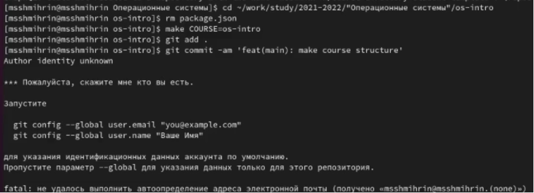
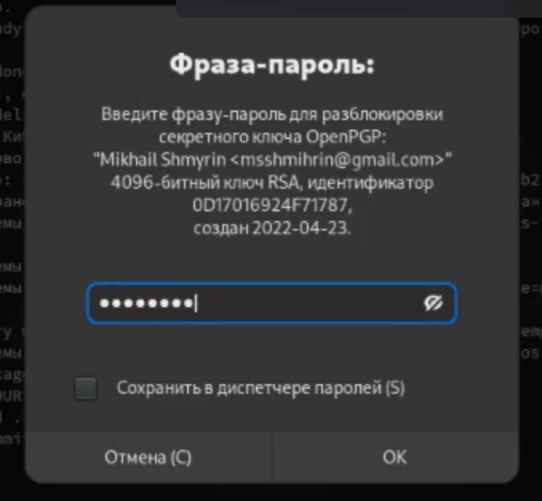

# РОССИЙСКИЙ УНИВЕРСИТЕТ ДРУЖБЫ НАРОДОВ  
Факультет физико-математических и естественных наук  
Кафедра прикладной информатики и теории вероятностей

Отчет по лабораторной работе №2:  
"Лабораторная работа № 2. Управление версиями" 

Дисциплина: Операционные системы  
Автор: Шмырин Михаил Сергеевич  
Номер группы: НПМбд-02-21  
Преподаватель: Кулябов Дмитрий Сергеевич

Москва

2022г.

# 2.1. Цель работы

– Изучить идеологию и применение средств контроля версий.

– Освоить умения по работе с git.

# 2.6. Последовательность выполнения работы
## 	2.6.1. Настройка github и заполнение данных(Рис 1.)

# 2.6.2. Установка программного обеспечения  (Рис 2.)
## 2.6.2.1. Установка git-flow в Fedora Linux с помощью нескольких команд(Рис 2.)

# 2.6.2.2. Установка gh в Fedora Linux (Рис 3.)

# 2.6.3. Базовая настройка git (Рис 4.)

# 2.6.4. Создайте ключи ssh (Рис 5.)

# 2.6.5. Создайте ключи pgp (Рис 6.)

# 2.6.6. Добавление PGP ключа в GitHub (Рис 7. и Рис 8. и Рис 9.)

# И вставляем его на гитхаб (Рис 10.)

# 2.6.7. Настройка автоматических подписей коммитов git(Рис 11.)

# 2.6.8. Настройка gh (авторизация через браузер)(Рис 12-15.)

# 2.6.9. Шаблон для рабочего пространства(Рис 16.)

# 2.6.9.1. Сознание репозитория курса на основе шаблона(Рис 17-18)

# 2.6.9.2. Настройка каталога курса(Рис 19-20)

Попросил повторно авторизоваться(Рис 21)

Потом ввести фразу-пароль(Рис 22)

И команда выполнена! (Рис 23)

# 2.7. Вывод

Я изучил идеологию и применение контроля версий.

# 2.8. Контрольные вопросы

## 2.8.1. Что такое системы контроля версий (VCS) и для решения каких задач они предназначаются? 
Система контроля версий Git представляет собой набор программ командной строки. Доступ к ним можно получить из терминала посредством ввода команды git с различными опциями. Системы контроля версий (Version Control System, VCS)применяются при работе нескольких человек над одним проектом.

# 2.8.2. Объясните следующие понятия VCS и их отношения: хранилище, commit, история, рабочая копия. 
В классических системах контроля версий используется централизованная модель, предполагающая наличие единого репозитория для хранения файлов. Выполнение большинства функций по управлению версиями осуществляется специальным сервером. Участник проекта (пользователь) перед началом работы посредством определённых команд получает нужную ему версию файлов. После внесения изменений, пользователь размещает новую версию в хранилище. При этом предыдущие версии не удаляются из центрального хранилища и к ним можно вернуться в любой момент. Сервер может сохранять неполную версию изменённых файлов, а производить так называемую дельта-компрессию—сохранять только изменения между последовательными версиями, что позволяет уменьшить объём хранимых данных.
Системы контроля версий также могут обеспечивать дополнительные, более гибкие функциональные возможности. Например, они могут поддерживать работу с несколькими версиями одного файла, сохраняя общую историю изменений до точки ветвления версий и собственные истории изменений каждой ветви. Кроме того, обычно доступна информация о том, кто из участников, когда и какие изменения вносил. Обычно такого рода информация хранится в журнале изменений, доступ к которому можно ограничить.

# 2.8.3. Что представляют собой и чем отличаются централизованные и децентрализованные VCS? Приведите примеры VCS каждого вида. 
Централизованные системы — это системы, которые используют архитектуру клиент / сервер, где один или несколько клиентских узлов напрямую подключены к центральному серверу. Пример - Wikipedia.
В децентрализованных системах каждый узел принимает свое собственное решение. Конечное поведение системы является совокупностью решений отдельных узлов. Пример — Bitcoin.
В классических системах контроля версий используется централизованная модель, предполагающая наличие единого репозитория для хранения файлов. Выполнение большинства функций по управлению версиями осуществляется специальным сервером.

# 2.8.4. Опишите действия с VCS при единоличной работе с хранилищем. 
Создадим локальный репозиторий. Сначала сделаем предварительную конфигурацию, указав имя и email владельца репозитория:
git config --global user.name"Имя Фамилия"
git config --global user.email"work@mail"
и настроив utf-8 в выводе сообщений git:
git config --global quotepath false
Для инициализации локального репозитория, расположенного, например, в каталоге ~/tutorial, необходимо ввести в командной строке:
cd
mkdir tutorial
cd tutorial
git init

# 2.8.5. Опишите порядок работы с общим хранилищем VCS. 
Для последующей идентификации пользователя на сервере репозиториев необходимо сгенерировать пару ключей (приватный и открытый):
ssh-keygen -C"Имя Фамилия <work@mail>"
Ключи сохраняться в каталоге~/.ssh/.
Скопировав из локальной консоли ключ в буфер обмена
cat ~/.ssh/id_rsa.pub | xclip -sel clip вставляем ключ в появившееся на сайте поле.

# 2.8.6. Каковы основные задачи, решаемые инструментальным средством git? 
У Git две основных задачи: первая — хранить информацию о всех изменениях в вашем коде, начиная с самой первой строчки, а вторая — обеспечение удобства командной работы над кодом.

# 2.8.7. Назовите и дайте краткую характеристику командам git. 
Основные команды git:
Наиболее часто используемые команды git: – создание основного дерева репозитория :git init–получение обновлений (изменений) текущего дерева из центрального репозитория: git pull–отправка всех произведённых изменений локального дерева в центральный репозиторий:git push–просмотр списка изменённых файлов в текущей директории: git status–просмотр текущих изменения: git diff–сохранение текущих изменений:–добавить все изменённые и/или созданные файлы и/или каталоги: git add .–добавить конкретные изменённые и/или созданные файлы и/или каталоги: git add имена_файлов – удалить файл и/или каталог из индекса репозитория (при этом файл и/или каталог остаётся в локальной директории): git rm имена_файлов – сохранение добавленных изменений: – сохранить все добавленные изменения и все изменённые файлы: git commit -am 'Описание коммита'–сохранить добавленные изменения с внесением комментария через встроенный редактор: git commit–создание новой ветки, базирующейся на текущей: git checkout -b имя_ветки–переключение на некоторую ветку: git checkout имя_ветки (при переключении на ветку, которой ещё нет в локальном репозитории, она будет создана и связана с удалённой) – отправка изменений конкретной ветки в центральный репозиторий: git push origin имя_ветки–слияние ветки стекущим деревом:git merge --no-ff имя_ветки–удаление ветки: – удаление локальной уже слитой с основным деревом ветки:git branch -d имя_ветки–принудительное удаление локальной ветки: git branch -D имя_ветки–удаление ветки с центрального репозитория: git push origin :имя_ветки

# 2.8.8. Приведите примеры использования при работе с локальным и удалённым репозиториями. 
Использования git при работе с локальными репозиториями (добавления текстового документа в локальный репозиторий):
git add hello.txt
git commit -am 'Новый файл’

# 2.8.9. Что такое и зачем могут быть нужны ветви (branches)? 
Проблемы, которые решают ветки git:
•	нужно постоянно создавать архивы с рабочим кодом
•	сложно "переключаться" между архивами
•	сложно перетаскивать изменения между архивами
•	легко что-то напутать или потерять

# 2.8.10. Как и зачем можно игнорировать некоторые файлы при commit?
Во время работы над проектом так или иначе могут создаваться файлы, которые не требуется добавлять в последствии в репозиторий. Например, временные файлы, создаваемые редакторами, или объектные файлы, создаваемые компиляторами. Можно прописать шаблоны игнорируемых при добавлении в репозиторий типов файлов в файл.gitignore с помощью сервисов. Для этого сначала нужно получить списоки меняющихся шаблонов: curl -L -s https://www.gitignore.io/api/list
Затем скачать шаблон, например, для C и C++
curl -L -s https://www.gitignore.io/api/c >> .gitignore
curl -L -s https://www.gitignore.io/api/c++ >> .gitignore

# 2.9. Вывод
Я изучил идеологию и применение контроля версий.
