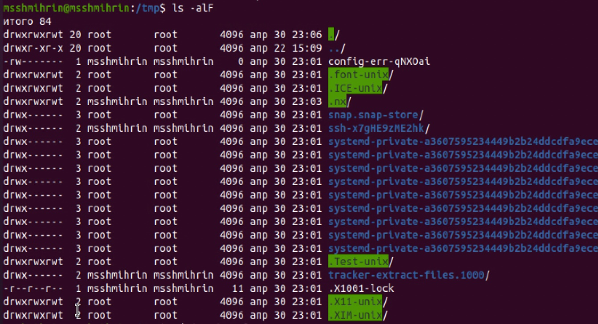

# РОССИЙСКИЙ УНИВЕРСИТЕТ ДРУЖБЫ НАРОДОВ  
Факультет физико-математических и естественных наук  
Кафедра прикладной информатики и теории вероятностей

Отчет по лабораторной работе №4:  
"Лабораторная работа № 4. Основы интерфейса взаимодействия пользователя с системой Unix на уровне командной строки" 

Дисциплина: Операционные системы  
Автор: Шмырин Михаил Сергеевич  
Номер группы: НПМбд-02-21  
Преподаватель: Кулябов Дмитрий Сергеевич

Москва

2022г.

# 4.1. Цель работы

Приобретение практических навыков взаимодействия пользователя с системой посредством командной строки.

# 4.2. Указания к работе

В операционной системе типа Linux взаимодействие пользователя с системой обычно
осуществляется с помощью командной строки посредством построчного ввода команд. При этом обычно используется командные интерпретаторы языка shell: /bin/sh;
/bin/csh; /bin/ksh

# 4.3. Последовательность выполнения работы
## 	1.	Определяем полное имя домашнего каталога с помощью команды pwd (рис. 1)

## 2.	Выполним действия:
### 1)	Переходим в каталог /tmp. Выводим на экран содержимое каталога/tmp.Для этого используем команду ls с различными опциями.
“ls” - выводится список каталогов и файлов, которые можно увидеть, “вручную” открыв каталог tmp (рис. 2)

# “ls -a” - к списку, описанному в предыдущем пункте, добавляются скрытые каталоги и файлы (рис. 3)

## “ls -F” - с помощью этой команды получаем информацию о типах файлов (рис. 4)

# “ls -l” - получаем список каталогов и файлов, но уже с более подробной информацией о них (рис. 5)

## “ls -alF” - данная команда отображает список всех каталогов и файлов, в том числе и скрытых, с подробной информацией о них (рис. 6)

# 2)	Определяем ,есть ли в каталоге /var/spool подкаталог с именем cron (рис. 7)

## 3)	Переходим в домашний каталог и выводим на экран его содержимое (рис. 8)

# 3.	Выполним действия:
## 1)	В домашнем каталоге создаем новый каталог с именем newdir. В каталоге ~/newdir создаем новый каталог с именем morefun (рис. 9)

### 2)	В домашнем каталоге создаем одной командой три новых каталога с именами letters, memos, misk. Затем удаляем эти каталоги одной командой.(рис. 10)

# 3)	Попробуем удалить ранее созданный каталог ~/newdir командой rm. Он не удалён.(рис. 11)

## 4)	Удаляем каталог ~/newdir/morefun из домашнего каталога. Проверяем, был ли каталог удалён. (рис. 12)

# 4.	С помощью команды man определяем, какую опцию команды ls нужно использовать для просмотра содержимого не только указанного каталога, но и подкаталогов, входящих в него.(рис. 13)

## 5.	С помощью команды man определите опцию команды ls, позволяющую отсортировать по времени последнего изменения выводимый список содержимого каталога с развёрнутым описанием файлов.(рис. 14)

# 6.	Используем команду man для просмотра описания следующих команд:cd,pwd,mkdir,rmdir,rm.
## 1)	Описание команды сd (рис. 15)

# 2)	Описание команды pwd (рис. 16)

# 3)	Описание команды mkdir (рис. 17)

# 4)	Описание команды rmdir (рис. 18)

# 5)	Описание команды rm (рис. 19)

