---
## Front matter
lang: ru-RU
title: Отчет по лабораторной работе №5
author: Шмырин Михаил Сергеевич
institute: РУДН, г. Москва, Россия
date: 07.05.2022

## Formatting
toc: false
slide_level: 2
theme: metropolis
header-includes: 
 - \metroset{progressbar=frametitle,sectionpage=progressbar,numbering=fraction}
 - '\makeatletter'
 - '\beamer@ignorenonframefalse'
 - '\makeatother'
aspectratio: 43
section-titles: true
---

# Цель работы

Ознакомление с файловой системой Linux, её структурой, именами и содержанием каталогов. Приобретение практических навыков по применению команд для работы с файлами и каталогами, по управлению процессами (и работами), по проверке использования диска и обслуживанию файловой системы.

# Задание

1. Выполните все примеры, приведённые в первой части описания лабораторной работы.
2. Выполните следующие действия, зафиксировав в отчёте по лабораторной работе
используемые при этом команды и результаты их выполнения:
	1. Скопируйте файл /usr/include/sys/io.h в домашний каталог и назовите его equipment. Если файла io.h нет, то используйте любой другой файл в каталоге /usr/include/sys/ вместо него.
	2. В домашнем каталоге создайте директорию ~/ski.plases.
	3. Переместите файл equipment в каталог ~/ski.plases.
	4. Переименуйте файл ~/ski.plases/equipment в ~/ski.plases/equiplist.
	5. Создайте в домашнем каталоге файл abc1 и скопируйте его в каталог ~/ski.plases, назовите его equiplist2.
	6. Создайте каталог с именем equipment в каталоге ~/ski.plases.
	7. Переместите файлы ~/ski.plases/equiplist и equiplist2 в каталог ~/ski.plases/equipment.
	8. Создайте и переместите каталог ~/newdir в каталог ~/ski.plases и назовите его plans.
3. Определите опции команды chmod, необходимые для того, чтобы присвоить перечисленным ниже файлам выделенные права доступа, считая, что в начале таких прав нет:
	1. drwxr--r-- ... australia
	2. drwx--x--x ... play
	3. -r-xr--r-- ... my_os
	4. -rw-rw-r-- ... feathers
При необходимости создайте нужные файлы.
4. Проделайте приведённые ниже упражнения, записывая в отчёт по лабораторной работе используемые при этом команды:
	1. Просмотрите содержимое файла /etc/password.
	2. Скопируйте файл ~/feathers в файл ~/file.old.
	3. Переместите файл ~/file.old в каталог ~/play.
	4. Скопируйте каталог ~/play в каталог ~/fun.
	5. Переместите каталог ~/fun в каталог ~/play и назовите его games.
	6. Лишите владельца файла ~/feathers права на чтение.
	7. Что произойдёт, если вы попытаетесь просмотреть файл ~/feathers командой cat?
	8. Что произойдёт, если вы попытаетесь скопировать файл ~/feathers?
	9. Дайте владельцу файла ~/feathers право на чтение.
	10. Лишите владельца каталога ~/play права на выполнение.
	11. Перейдите в каталог ~/play. Что произошло?
	12. Дайте владельцу каталога ~/play право на выполнение.
5. Прочитайте man по командам mount, fsck, mkfs, kill и кратко их охарактеризуйте,
приведя примеры.

# Выполнение лабораторной работы

1. Я выполнил все примеры, приведенные в части описания лабораторной работы, в том числе создавал (touch, mkdir), копировал (cp), перемещал и переименовал (mv) файлы и каталоги may, april, june, monthly, monthly.00, monthly.01, abc1, а также изменял (chmod) их права доступа (рис. 1, рис.2, рис.3).

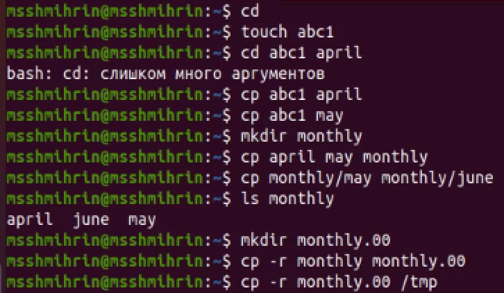{ #fig:001 width=70% }

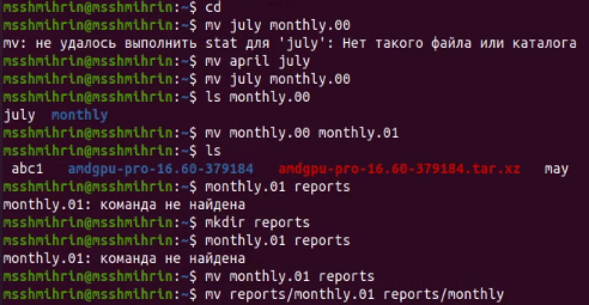{ #fig:002 width=70% }

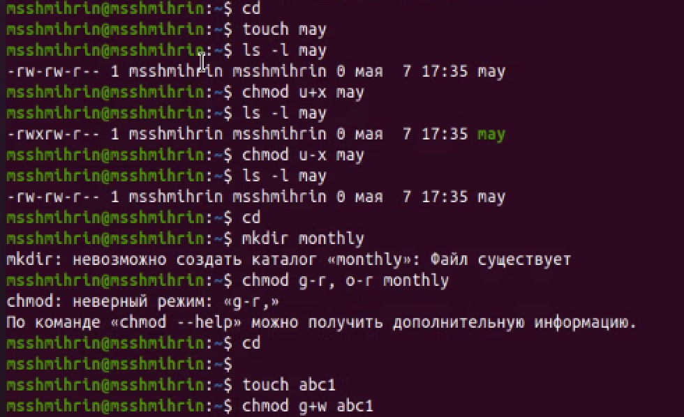{ #fig:003 width=70% }

2. Я скопировал файл /usr/include/sys/io.h в домашний каталог и назвал его equipment (cp /usr/include/sys/io.h equipment). В домашнем каталоге создал директорию ~/ski.places (mkdir /ski.places), переместил туда файл equipment (mv equipment ski.places) и переименовал в equiplist (mv /ski.places/equipment ski.places/equiplist). Создал в домашнем каталоге файл abc1 и скопировал его в каталог, назвав его equiplist2 (touch abc1, cp abc1 ski.places/equiplist2). Создал каталог с именем equipment в каталоге ~/ski.places (mkdir ski.places/equipment) и переместил туда файлы equiplist и equiplist2 (mv ski.places/equipment ski.places/equiplist2 ski.places/equipment) и проверил с помощью ls. Затем я создал и переместил каталог ~/newdir в каталог ~/ski.places и назвал его plans (mkdir newdir, mv newdir ski.places, mv ski.places/newdir ski.places/plans) (рис. 4).

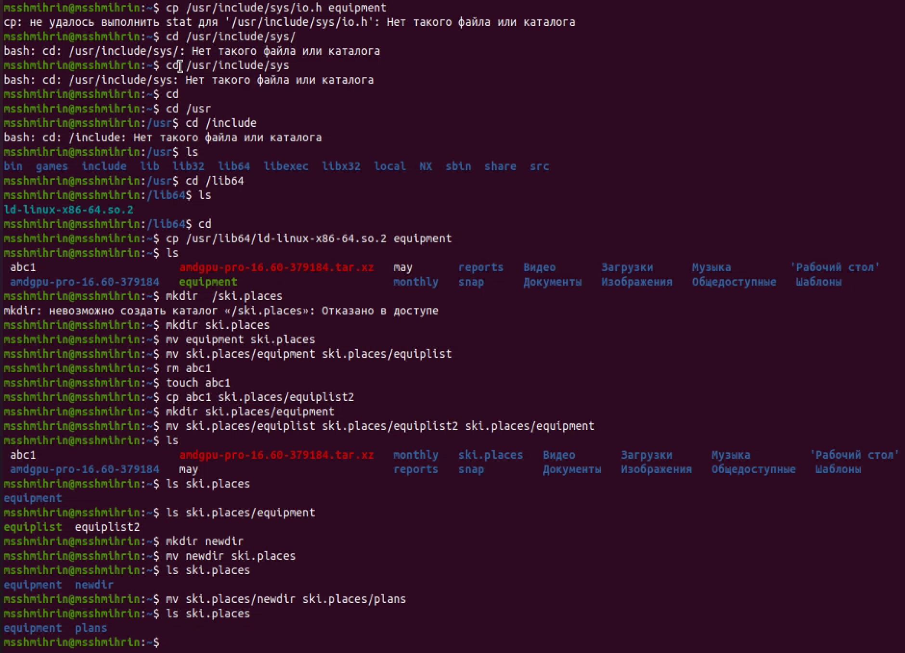{ #fig:004 width=70% }

3. Я создал каталоги australia и play, файлы my_os и feathers, а затем изменил с помощью команды chmod и соответсвующих опций права доступа на требуемые: chmod 744 australia, chmod 711 play, chmod 544 my_os, chmod 664 feathers - и проверил результат с помощью ls -l (рис. 5).

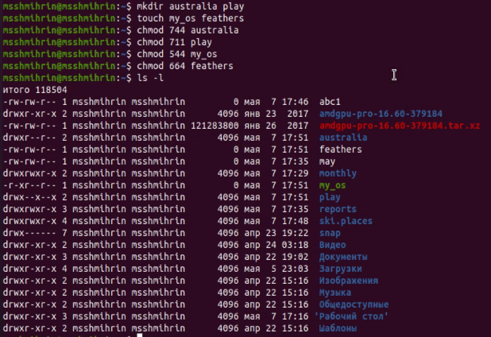{ #fig:005 width=70% }

4. Я посмотрел содержимое файла /etc/passwd (в папке не было файла password) с помощью команды cat /etc/passwd (рис. 6). Затем я скопировал ~/feathers в файл ~/file.old (cp feathers file.old), переместил файл ~/file.old в каталог ~/play (mv file.old play). Скопировал каталог ~/play в каталог ~/fun (cp -r play fun), переместил каталог ~/fun в каталог ~/play и назвал его games (mv fun play, mv play/fun play/games). (рис. 7)

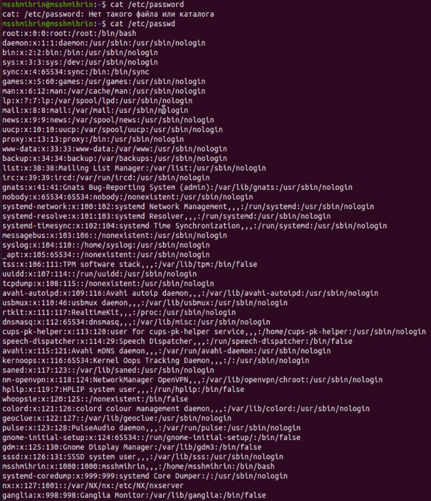{ #fig:006 width=70% }

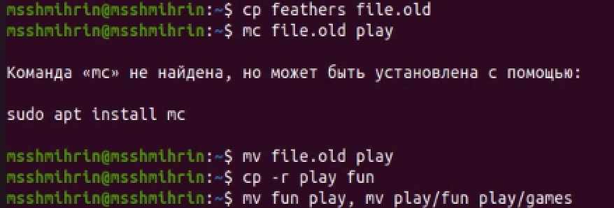{ #fig:007 width=70% }

5. Я лишил владельца файла ~/feathers права на чтение (chmod u-r feathers). В просмотре файла командой cat было отказано по причине отсутствия доступа. По той же причине не удалось его скопировать с помощью cp: он был недоступен для чтения. Я дал владельцу файла ~/feathers право на чтение (chmod u+r feathers) и лишил владельца права на выполнение каталога ~/play (chmod u-x play). В доступе при переходе в этот каталог мне было отказано (cd play). Затем я дал владельцу право на выполнение с помощью chmod u+x play. (рис. 8)

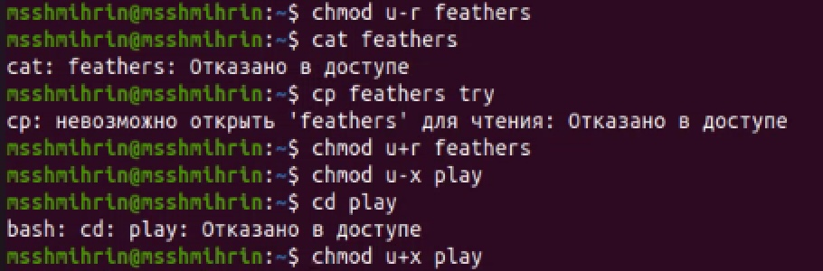{ #fig:008 width=70% }

7. Прочитал с помощью команды man справки по командам mount, fsck, mkfs, kill (рис. 9,10,11,12).'
mount монтирует файловую систему. Все файлы в системе Unix организованы в дерево, имеющее корневой каталог /. Эти файлы могут быть распределены на несколько устройств. Mount позволяет смонтировать файловую систему с устройства к большому файловому дереву. Пример импользования: mount без параметров позволяет узнать какие используются в операционной системе файловые системы.
fsck  проверяет и восстанавливает файловую систему Linux по имени устройства или точке монтирования. Например, fsck /usr. Команда возвращает число, которое означает сумму некоторых найденных условий, например, что ошибок нет.
mkfs создает файловую систему Linux и возвращает 0 в случае успеха, 1 в случае неудачи. Например, mkfs -t ext4 -L root/dev/sda6.
kill передает процессу сигнал завершения, например, по его PID. Например, kill 2600 завершит процесс с PID 2600.

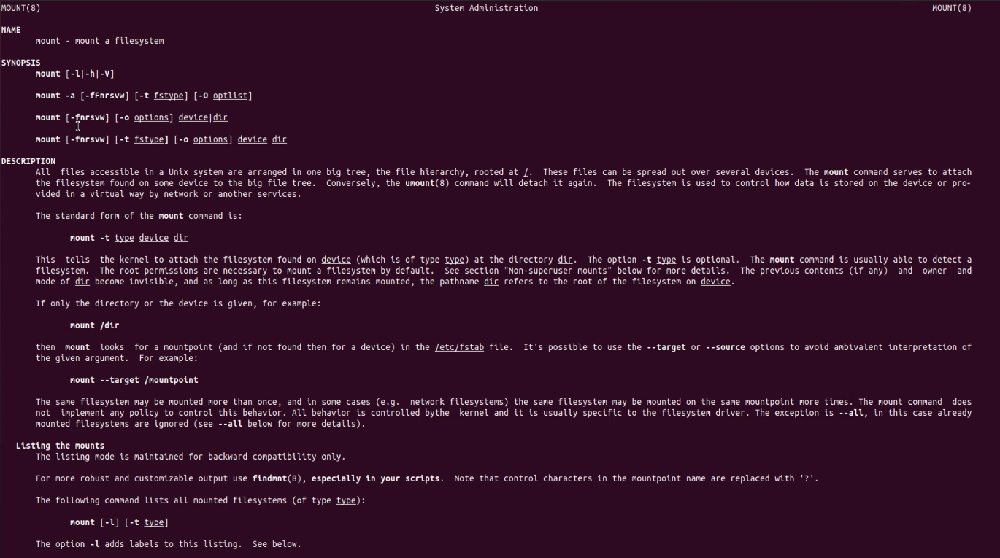{ #fig:009 width=70% }

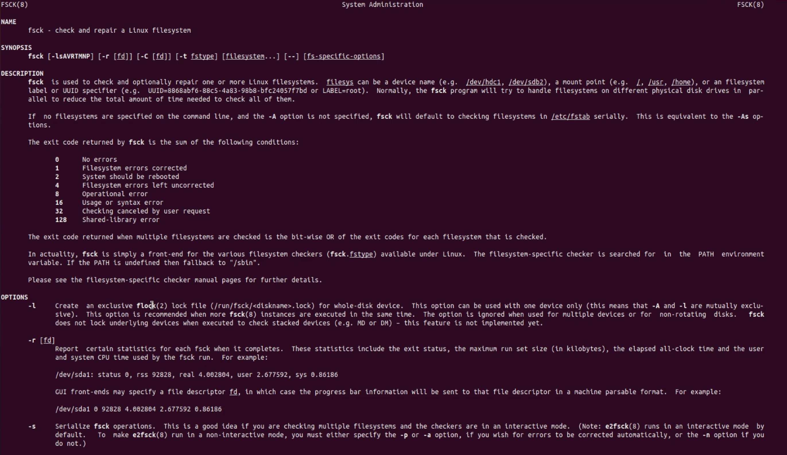{ #fig:010 width=70% }

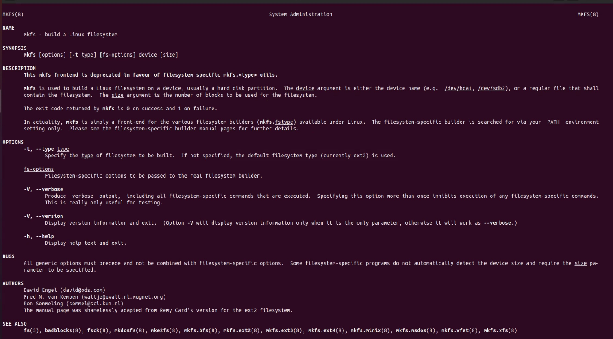{ #fig:011 width=70% }

{ #fig:012 width=70% }

# Выводы

В ходе выполнения данной лабораторной работы я онакомилась с файловой системой Linux, её структурой, именами и содержанием каталогов, приобрел практические навыки по применению команд для работы с файлами и каталогами, по управлению процессами (и работами), по проверке использования диска и обслуживанию файловой системы.

## {.standout}

Спасибо за внимание!
