---
# Front matter
title: "Отчёт по лабораторной работе №5"
subtitle: "Дисциплина: Операционные системы"
author: "Шмырин Михаил Сергеевич"

## Generic options
lang: ru-RU
toc-title: "Содержание"

## Bibliography
bibliography: bib/cite.bib
csl: pandoc/csl/gost-r-7-0-5-2008-numeric.csl

## Pdf output format
toc: true # Table of contents
toc-depth: 2
lof: true # List of figures
lot: true # List of tables
fontsize: 12pt
linestretch: 1.5
papersize: a4
documentclass: scrreprt
## I18n polyglossia
polyglossia-lang:
  name: russian
  options:
	- spelling=modern
	- babelshorthands=true
polyglossia-otherlangs:
  name: english
## I18n babel
babel-lang: russian
babel-otherlangs: english
## Fonts
mainfont: PT Serif
romanfont: PT Serif
sansfont: PT Sans
monofont: PT Mono
mainfontoptions: Ligatures=TeX
romanfontoptions: Ligatures=TeX
sansfontoptions: Ligatures=TeX,Scale=MatchLowercase
monofontoptions: Scale=MatchLowercase,Scale=0.9
## Biblatex
biblatex: true
biblio-style: "gost-numeric"
biblatexoptions:
  - parentracker=true
  - backend=biber
  - hyperref=auto
  - language=auto
  - autolang=other*
  - citestyle=gost-numeric
## Pandit-crossref LaTeX customization
figureTitle: "Рис."
tableTitle: "Таблица"
listingTitle: "Листинг"
lofTitle: "Список иллюстраций"
lotTitle: "Список таблиц"
lolTitle: "Листинги"
## Misc options
indent: true
header-includes:
  - \usepackage{indentfirst}
  - \usepackage{float} # keep figures where there are in the text
  - \floatplacement{figure}{H} # keep figures where there are in the text
---

# Цель работы

Ознакомление с файловой системой Linux, её структурой, именами и содержанием каталогов. Приобретение практических навыков по применению команд для работы с файлами и каталогами, по управлению процессами (и работами), по проверке использования диска и обслуживанию файловой системы.
# Задание

1. Выполните все примеры, приведённые в первой части описания лабораторной работы.
2. Выполните следующие действия, зафиксировав в отчёте по лабораторной работе
используемые при этом команды и результаты их выполнения:
	1. Скопируйте файл /usr/include/sys/io.h в домашний каталог и назовите его equipment. Если файла io.h нет, то используйте любой другой файл в каталоге /usr/include/sys/ вместо него.
	2. В домашнем каталоге создайте директорию ~/ski.plases.
	3. Переместите файл equipment в каталог ~/ski.plases.
	4. Переименуйте файл ~/ski.plases/equipment в ~/ski.plases/equiplist.
	5. Создайте в домашнем каталоге файл abc1 и скопируйте его в каталог ~/ski.plases, назовите его equiplist2.
	6. Создайте каталог с именем equipment в каталоге ~/ski.plases.
	7. Переместите файлы ~/ski.plases/equiplist и equiplist2 в каталог ~/ski.plases/equipment.
	8. Создайте и переместите каталог ~/newdir в каталог ~/ski.plases и назовите его plans.
3. Определите опции команды chmod, необходимые для того, чтобы присвоить перечисленным ниже файлам выделенные права доступа, считая, что в начале таких прав нет:
	1. drwxr--r-- ... australia
	2. drwx--x--x ... play
	3. -r-xr--r-- ... my_os
	4. -rw-rw-r-- ... feathers
При необходимости создайте нужные файлы.
4. Проделайте приведённые ниже упражнения, записывая в отчёт по лабораторной работе используемые при этом команды:
	1. Просмотрите содержимое файла /etc/password.
	2. Скопируйте файл ~/feathers в файл ~/file.old.
	3. Переместите файл ~/file.old в каталог ~/play.
	4. Скопируйте каталог ~/play в каталог ~/fun.
	5. Переместите каталог ~/fun в каталог ~/play и назовите его games.
	6. Лишите владельца файла ~/feathers права на чтение.
	7. Что произойдёт, если вы попытаетесь просмотреть файл ~/feathers командой cat?
	8. Что произойдёт, если вы попытаетесь скопировать файл ~/feathers?
	9. Дайте владельцу файла ~/feathers право на чтение.
	10. Лишите владельца каталога ~/play права на выполнение.
	11. Перейдите в каталог ~/play. Что произошло?
	12. Дайте владельцу каталога ~/play право на выполнение.
5. Прочитайте man по командам mount, fsck, mkfs, kill и кратко их охарактеризуйте,
приведя примеры.

# Теоретическое введение

## Команды для работы с файлами

Для создания текстового файла можно использовать команду touch. Для просмотра файлов небольшого размера можно использовать команду cat. Для просмотра файлов постранично удобнее использовать команду less. Команда head выводит по умолчанию первые 10 строк файла. Команда tail выводит умолчанию 10 последних строк файла. Команда cp используется для копирования файлов и каталогов. Опция i в команде cp выведет на экран запрос подтверждения о перезаписи файла. Для рекурсивного копирования каталогов, содержащих файлы, используется команда cp с опцией r. Команды mv и mvdir предназначены для перемещения и переименования файлов и каталогов.

## Права доступа
Каждый файл или каталог имеет права доступа. В сведениях о файле или каталоге указываются:

- тип файла (символ (-) обозначает файл, а символ (d) — каталог);
- права для владельца файла (r — разрешено чтение, w — разрешена запись, x — разрешено выполнение, - — право доступа отсутствует);
- права для членов группы (r — разрешено чтение, w — разрешена запись, x — разрешено выполнение, - — право доступа отсутствует);
- права для всех остальных (r — разрешено чтение, w — разрешена запись, x — разрешено выполнение, - — право доступа отсутствует).

Права доступа к файлу или каталогу можно изменить, воспользовавшись командой chmod. Сделать это может владелец файла (или каталога) или пользователь с правами администратора. Режим (в формате команды) имеет следующие компоненты структуры и способ записи:
'=' установить право
'-' лишить права
'+' дать право
'r' чтение
'w' запись
'x' выполнение
'u' (user) владелец файла
'g' (group) группа, к которой принадлежит владелец файла
'o' (others) все остальные
В работе с правами доступа можно использовать их цифровую запись (восьмеричное значение) вместо символьной.

## Анализ файловой системы

Файловая система в Linux состоит из фалов и каталогов. Каждому физическому носителю соответствует своя файловая система. Существует несколько типов файловых систем. Наиболее часто встречаются: 

- ext2fs (second extended filesystem);
- ext2fs (third extended file system);
- ext4 (fourth extended file system);
- ReiserFS;
- xfs;
- fat (file allocation table);
- ntfs (new technology file system)

Для просмотра используемых в операционной системе файловых систем можно воспользоваться командой mount без параметров. В контексте команды mount устройство — специальный файл устройства, с помощью которого операционная система получает доступ к аппаратному устройству. Файлы устройств обычно располагаются в каталоге /dev, имеют сокращённые имена (например, sdaN, sdbN или hdaN, hdbN, где N — порядковый номер устройства, sd — устройства SCSI, hd — устройства MFM/IDE).
Точка монтирования — каталог (путь к каталогу), к которому присоединяются файлы устройств.
Другой способ определения смонтированных в операционной системе файловых систем — просмотр файла/etc/fstab.
В каждой строке этого файла указано:

- имя устройство;
- точка монтирования;
- тип файловой системы;
- опции монтирования;
- специальные флаги для утилиты dump;
- порядок проверки целостности файловой системы с помощью утилиты fsck.

Для определения объёма свободного пространства на файловой системе можно воспользоваться командой df, которая выведет на экран список всех файловых систем в соответствии с именами устройств, с указанием размера и точки монтирования.
С помощью команды fsck можно проверить (а в ряде случаев восстановить) целостность файловой системы.

# Выполнение лабораторной работы

1. Я выполнил все примеры, приведенные в части описания лабораторной работы, в том числе создавал (touch, mkdir), копировал (cp), перемещал и переименовал (mv) файлы и каталоги may, april, june, monthly, monthly.00, monthly.01, abc1, а также изменял (chmod) их права доступа (рис. 1, рис.2, рис.3).

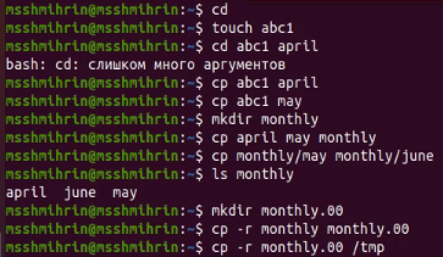{ #fig:001 width=70% }

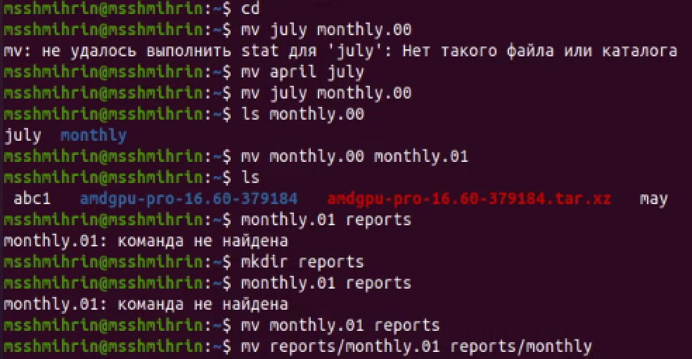{ #fig:002 width=70% }

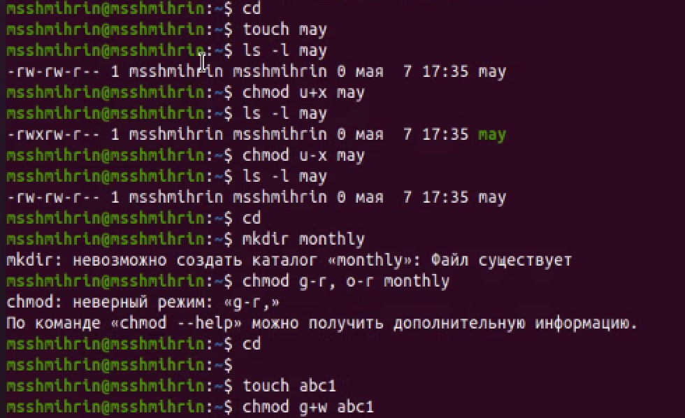{ #fig:003 width=70% }

2. Я скопировал файл /usr/include/sys/io.h в домашний каталог и назвал его equipment (cp /usr/include/sys/io.h equipment). В домашнем каталоге создал директорию ~/ski.places (mkdir /ski.places), переместил туда файл equipment (mv equipment ski.places) и переименовал в equiplist (mv /ski.places/equipment ski.places/equiplist). Создал в домашнем каталоге файл abc1 и скопировал его в каталог, назвав его equiplist2 (touch abc1, cp abc1 ski.places/equiplist2). Создал каталог с именем equipment в каталоге ~/ski.places (mkdir ski.places/equipment) и переместил туда файлы equiplist и equiplist2 (mv ski.places/equipment ski.places/equiplist2 ski.places/equipment) и проверил с помощью ls. Затем я создал и переместил каталог ~/newdir в каталог ~/ski.places и назвал его plans (mkdir newdir, mv newdir ski.places, mv ski.places/newdir ski.places/plans) (рис. 4).

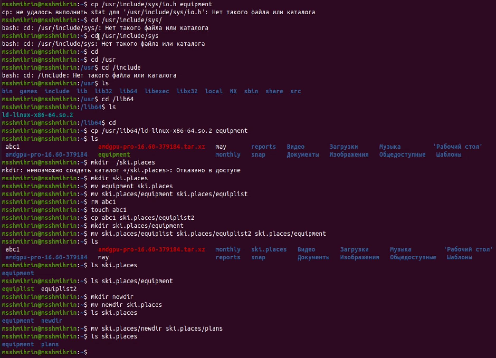{ #fig:004 width=70% }

3. Я создал каталоги australia и play, файлы my_os и feathers, а затем изменил с помощью команды chmod и соответсвующих опций права доступа на требуемые: chmod 744 australia, chmod 711 play, chmod 544 my_os, chmod 664 feathers - и проверил результат с помощью ls -l (рис. 5).

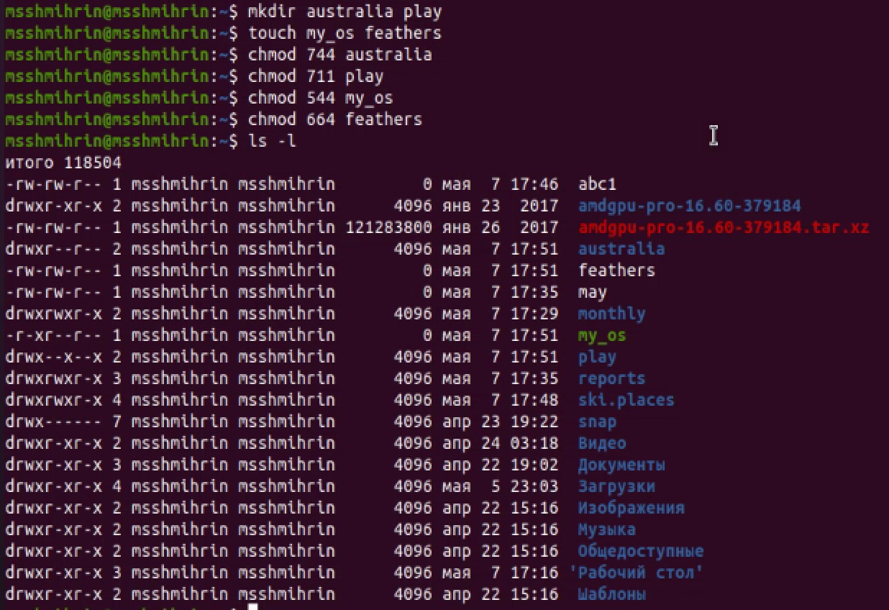{ #fig:005 width=70% }

4. Я посмотрел содержимое файла /etc/passwd (в папке не было файла password) с помощью команды cat /etc/passwd (рис. 6). Затем я скопировал ~/feathers в файл ~/file.old (cp feathers file.old), переместил файл ~/file.old в каталог ~/play (mv file.old play). Скопировал каталог ~/play в каталог ~/fun (cp -r play fun), переместил каталог ~/fun в каталог ~/play и назвал его games (mv fun play, mv play/fun play/games). (рис. 7)

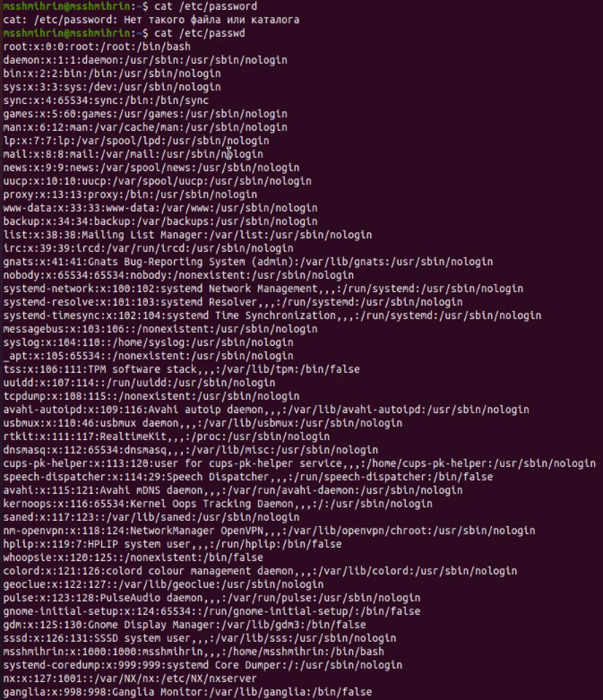{ #fig:006 width=70% }

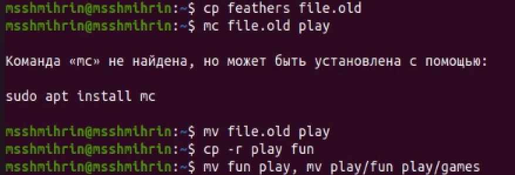{ #fig:007 width=70% }

5. Я лишил владельца файла ~/feathers права на чтение (chmod u-r feathers). В просмотре файла командой cat было отказано по причине отсутствия доступа. По той же причине не удалось его скопировать с помощью cp: он был недоступен для чтения. Я дал владельцу файла ~/feathers право на чтение (chmod u+r feathers) и лишил владельца права на выполнение каталога ~/play (chmod u-x play). В доступе при переходе в этот каталог мне было отказано (cd play). Затем я дал владельцу право на выполнение с помощью chmod u+x play. (рис. 8)

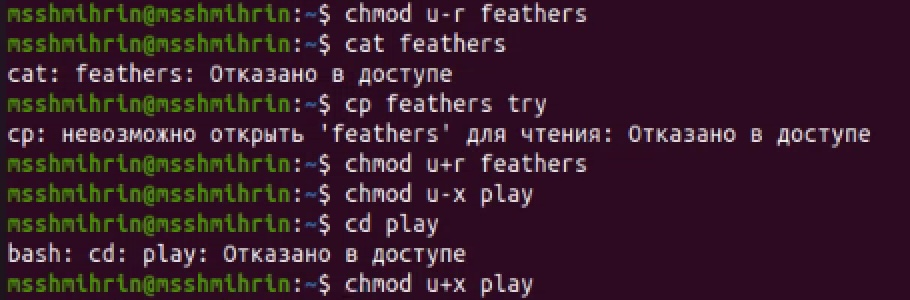{ #fig:008 width=70% }

7. Прочитал с помощью команды man справки по командам mount, fsck, mkfs, kill (рис. 9,10,11,12).'
mount монтирует файловую систему. Все файлы в системе Unix организованы в дерево, имеющее корневой каталог /. Эти файлы могут быть распределены на несколько устройств. Mount позволяет смонтировать файловую систему с устройства к большому файловому дереву. Пример импользования: mount без параметров позволяет узнать какие используются в операционной системе файловые системы.
fsck  проверяет и восстанавливает файловую систему Linux по имени устройства или точке монтирования. Например, fsck /usr. Команда возвращает число, которое означает сумму некоторых найденных условий, например, что ошибок нет.
mkfs создает файловую систему Linux и возвращает 0 в случае успеха, 1 в случае неудачи. Например, mkfs -t ext4 -L root/dev/sda6.
kill передает процессу сигнал завершения, например, по его PID. Например, kill 2600 завершит процесс с PID 2600.

{ #fig:009 width=70% }

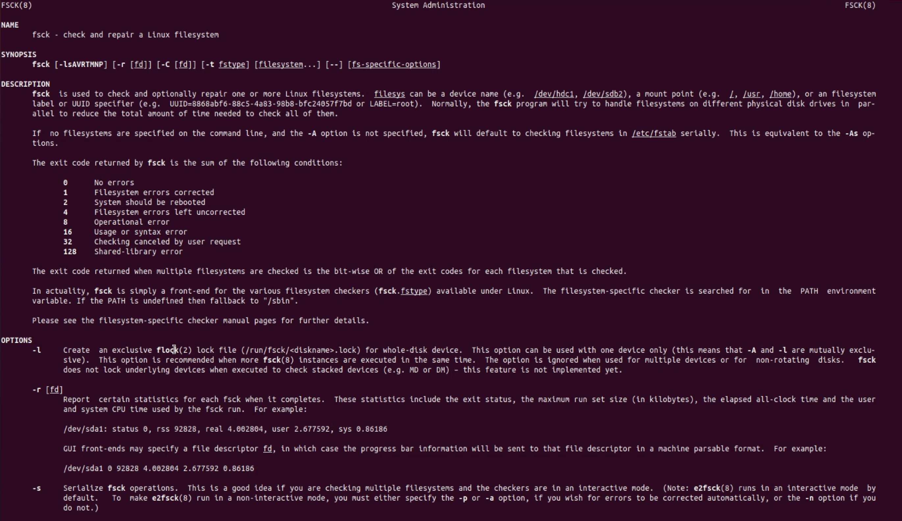{ #fig:010 width=70% }

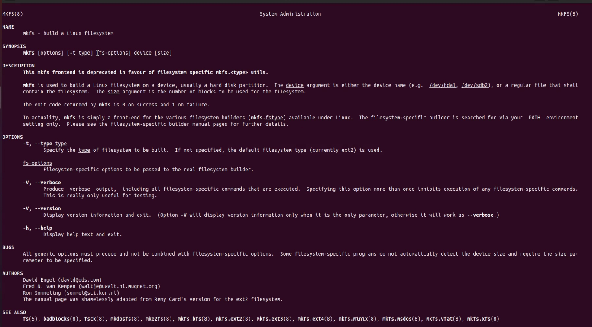{ #fig:011 width=70% }

{ #fig:012 width=70% }

# Выводы

В ходе выполнения данной лабораторной работы я онакомилась с файловой системой Linux, её структурой, именами и содержанием каталогов, приобрел практические навыки по применению команд для работы с файлами и каталогами, по управлению процессами (и работами), по проверке использования диска и обслуживанию файловой системы.

# Ответы на контрольные вопросы

1. Дайте характеристику каждой файловой системе, существующей на жёстком диске компьютера, на котором вы выполняли лабораторную работу.

На жестком диске моего компьютера существуют две системы: btrfs и ext4 (рис. 13)
btrfs
BTRFS (B-Tree Filesystem) — файловая система для Unix-подобных операционных систем, основанная на технике «Copy on Write» (CoW), призванная обеспечить легкость масштабирования файловой системы, высокую степень надежности и сохранности данных, гибкость настроек и легкость администрирования, сохраняя при этом высокую скорость работы.
Основные возможности:

- Максимальный размер файла 2^64 байт
- Динамическая таблица inode
- Дедупликация данных
- Эффективное хранение файлов как очень малых, так и очень больших размеров
- Создание сабвольюмов и снапшотов
- Квоты на размеры сабвольюмов
- Контрольные суммы для данных и метаданных
- Возможность объединить несколько накопителей в единую файловую систему
- Создание RAID конфигурации на уровне файловой системы
- Сжатие данных
- Дефрагментация данных на лету

btrfs из-за своей архитектуры крайне подвержена такому явлению, как фрагментация. Дело в том, что данные записываются всегда в новое расположение на диске. Даже если прочитать файл, ничего не сделать с данными и записать их обратно в тот же файл, то данные попадут на диске в новую область. То же самое произойдет, если обновить данные в файле только частично — изменения запишутся в новую область на диске. Таким образом, частые изменения весьма сильно фрагментируют файлы, увеличивая «разбросанность» фрагментов, в общем случае — по нескольким дискам. Это приводит к увеличенной нагрузке на CPU и неоправданному расходу памяти. Сильнее всего фрагментированности подвержены базы данных и образы виртуальных машин.

ext4

Раньше существовал небольшая операционная система MINIX, которая работал на IBM PC. Эндрю Танненбаум разработал её для обучения и выпустил исходный код в 1987 году. Линус Торвальдс разработал своё ядро Linux на основе MINIX и выпустил его в 1992 году. У MINIX была своя файловая система, которую и использовали первые версии Linux. Она могла работать с хранилищами до 64 мегабайт, а размер имён файлов не мог превышать 14 символов.
Реми Кард в 1992 году разработал первую файловую систему семейства Ext. Она решал большинство проблем MINIX. Новая файловая система использовал новую прослойку VFS в ядре Linux и теперь могла работать с дисками до 2 гигабайт, а имена файлов могли состоять из 255 символов. Но у Ext был один недостаток. Она имел только одну временную метку для файла, вместо теперешних трёх: даты создания, даты доступа и даты модификации.
Файловая система Ext4 была анонсирована в 2006 году и ею занимался уже другой разработчик. Его имя Теодор Цо. Файловая система значительно расширил возможности Ext4, но по прежнему опиралась на старую технологию.
Особенности ФС:

- Журналирование;
- Поддержка шифрования;
- Высокая стабильность, так как она проверена временем;
- Поддержка по умолчанию во многих дистрибутивах;
- Активная разработка;
- Не подвержена фрагментации;
- Лимитов вполне достаточно обычному пользователю, так и для серверных систем;
- Не поддерживаются функции файловых систем следующего поколения, такие как управление томами, дедупликация данных;
- Отсутствие проверки контрольных сумм для данных, что делает невозможным обнаружение повреждения данных из-за аппаратных сбоев оборудования.
- Плохая масштабируемость. Несмотря на то, что заявленный максимальный размер раздел один экзабайт, на деле лучше не создавать разделы больше 50 - 100 терабайт.

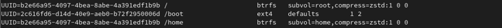{ #fig:013 width=70% }

2. Приведите общую структуру файловой системы и дайте характеристику каждой директории первого уровня этой структуры.

Общая структура файловой системы (рис. 14)

Нижний уровень - оборудование. Это в первую очередь, магнитные диски с подвижными головками - основные устройства внешней памяти, представляющие собой пакеты магнитных пластин (поверхностей), между которыми на одном рычаге двигается пакет магнитных головок. Шаг движения пакета головок является дискретным и каждому положению пакета головок логически соответствует цилиндр магнитного диска. Цилиндры делятся на дорожки (треки), а каждая дорожка размечается на одно и то же количество блоков (секторов), таким образом, что в каждый блок можно записать по максимуму одно и то же число байтов. Следовательно, для произведения обмена с магнитным диском на уровне аппаратуры нужно указать номер цилиндра, номер поверхности, номер блока на соответствующей дорожке и число байтов, которое нужно записать или прочитать от начал этого блока. Таким образом, диски могут быть разбиты на блоки фиксированного размера, и можно непосредственно получить доступ к любому блоку (организовать прямой доступ к файлам).

Непосредственно с устройствами (дисками) взаимодействует часть ОС, называемая система ввода-вывода (см. соответствующую главу). Система ввода-вывода (она состоит из драйверов устройств и обработчиков прерываний для передачи информации между памятью и дисковой системой) предоставляет в распоряжение более высокоуровневого компонента ОС - файловой системы используемое дисковое пространство в виде непрерывной последовательности блоков фиксированного размера. Система ввода-вывода имеет дело с физическими блоками диска, которые характеризуются адресом, например, диск 2, цилиндр 75, сектор 11. Файловая система имеет дело с логическими блоками, каждый из которых имеет номер (от 0 или 1 до N). Размер этих логических блоков файла совпадает или кратен размеру физического блока диска и может быть задан равным размеру страницы виртуальной памяти, поддерживаемой аппаратурой компьютера совместно с операционной системой.

В структуре системы управления файлами можно выделить базисную подсистему, которая отвечает за выделение дискового пространства конкретным файлам, и более высокоуровневую логическую подсистему, которая использует структуру дерева директорий для предоставления модулю базисной подсистемы необходимой ей информации исходя из символического имени файла. Она также ответственна за авторизацию доступа к файлам.

В современных ОС далее принято разбивать диски на логические диски (это также низкоуровневая операция), иногда называемые разделами (partitions). Бывает, что наоборот объединяют несколько физических дисков в один логический диск (например, как это можно сделать в ОС Windows NT). На каждом разделе можно иметь свою независимую файловую систему. Поэтому в дальнейшем изложении мы будем игнорировать проблему физического выделения пространства для файлов и считать, что каждый раздел представляет собой отдельный (виртуальный) диск. Собственно диск содержит иерархическую древовидную структуру, состоящую из набора файлов, каждый из которых является хранилищем данных пользователя, и каталогов или директорий (то есть файлов, которые содержат перечень других файлов, входящих в состав каталога), которые необходимы для хранения информации о файлах системы.

Стандартный запрос на открытие (open) или создание (creat) файла поступает от прикладной программы к логической подсистеме. Логическая подсистема, используя структуру директорий, проверяет права доступа и вызывает базовую подсистему для получения доступа к блокам файла. После этого файл считается открытым, содержится в таблице открытых файлов, прикладная программа получает в свое распоряжение дескриптор (или handle в системах Microsoft) этого файла. Дескриптор файла является ссылкой на файл в таблице открытых файлов и используется в запросах прикладной программы на чтение-запись из этого файла. Запись в таблице открытых файлов указывает через систему аллокации блоков диска на блоки данного файла. Если к моменту открытия файл уже используется другим процессом, то есть содержится в таблице открытых файлов, то, после проверки прав доступа к файлу может быть организован совместный доступ. При этом новому процессу также возвращается дескриптор - ссылка на файл в таблице открытых файлов. 

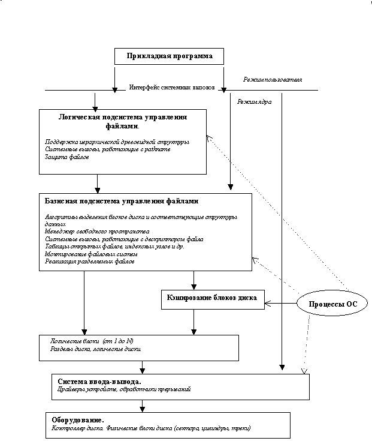{ #fig:014 width=70% }

Структура файловой системы на диске (рис. 15)

Структуры данных типовой файловой системы, например Unix, на одном из разделов диска, таким образом, может состоять из 4-х основных частей. В начале раздел находится суперблок, содержащий общее описание файловой системы. Описанные структуры данных создаются на диске в результате его форматирования (например, утилитами format, makefs и др.). Их наличие позволяет обращаться к данным на диске как к файловой системе, а не как к обычной последовательности блоков.

В файловых системах современных ОС для повышения устойчивости поддерживается несколько копий суперблока. В некоторых версиях Unix суперблок включал также и структуры данных, управляющие распределением дискового пространства, в результате чего суперблок непрерывно подвергался модификации, что снижало надежность файловой системы в целом. Выделение структур данных, описывающих дисковое пространство, в отдельную часть является более правильным решением.

Массив индексных узлов (ilist) содержит список индексов, соответствующих файлам данной файловой системы. Размер массива индексных узлов определяется администратором при установке системы. Максимальное число файлов, которые могут быть созданы в файловой системе, определяется числом доступных индексных узлов.

В блоках данных хранятся реальные данные файлов. Размер логического блока данных может задаваться при форматировании файловой системы. Заполнение диска содержательной информацией предполагает использование блоков хранения данных для файлов директорий и обычных файлов и имеет следствием модификацию массива индексных узлов и данных, описывающих пространство диска. Отдельно взятый блок данных может принадлежать одному и только одному файлу в файловой системе.

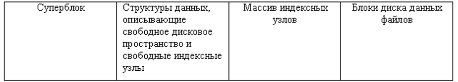{ #fig:015 width=70% }

Директории первого уровня:

/: Корневой каталог, в котором содержится вся иерархия системы.

/bin: Все исполнимые бинарные программы (файлы) необходимые во время загрузки, восстановления и ремонта системы; файлы, необходимые для запуска в однопользовательском режиме и другие важные, основные команды, такие как cat, du, df, tar, rpm, wc, history, и др. В настоящее время обычно представляет собой ссылку на директорию /usr/bin, то есть фактически исполнимые файлы находятся в папке /usr/bin.

/boot: Содержит важные файлы для процесса загрузки, включая ядро Linux. В современных системах при установке обычно на главном диске создаётся небольшой раздел, который затем монтируется в директорию /boot

/dev: Содержит файлы устройств для всех физических устройств на данной машине, например, cdrom, cpu и т. д. Как мы уже знаем, здесь же размещены файлы дисков — на случай, если понадобится смонтировать новый диск или сменный носитель.

/etc: Содержит файлы конфигурации приложений, а также файлы управления службами Systemd. То есть настройки системы, программ и служб хранятся именно в этой папке. Количество папок и файлов здесь может быть различным в зависимости от количество установленных программ на данной системе.

/home: домашний каталог пользователей. Каждый раз, когда создаётся новый пользователь, в домашнем каталоге создаётся каталог в соответствии с именем пользователя (например, для пользователя mial это будет /home/mial/), который содержит другие каталоги, такие как Рабочий стол (Desktop), Загрузки (Downloads), Документы (Documents) и т. д.

/lib: Каталог lib содержит модули ядра и образы общих библиотек, необходимые для загрузки системы и запуска команд в корневой файловой системе.

/lib64 – 64-битные основные библиотеки. Эта директория присутствует в основном на 64-битных системах, содержит набор библиотек и компонентов компилятора языка С для 64-битных программ.

/lost+found: Этот каталог создаётся во время установки Linux, полезен для восстановления файлов, которые могут быть повреждены из-за неожиданного завершения работы. Если программа для поиска ошибок в файловой системе выявил проблема (например, нашла повреждённые файлы), то эти файлы будут перемещены в этот каталог.

/media: Точки монтирования для съёмных носителей, таких как CD-ROM (появились в FHS-2.3).

/mnt: Каталог монтирования для временного монтирования файловых систем (внешних дисков, USB накопителей и т.д.).

/opt: Аббревиатура от слова «опциональный», то есть необязательный. Содержит стороннее программное обеспечение, такое как Java, cuda, dropbox, metasploit, viber, vuze и т.д.

/proc: Виртуальная и псевдо-файловая система, которая содержит информацию о запущенных процессах и настройках ядра в виде файлов. Виртуальная файловая система, предоставляющая информацию о процессах и ядре в виде файлов. В Linux соответствует монтированию procfs. Обычно автоматически генерируется и заполняется системой на лету.

/root: Домашняя директория пользователя root

/run: Информация о системе с момента её загрузки, в том числе данные, необходимые для работы демонов (pid-файлы, UNIX-сокеты и т.д.).

/sbin: Содержит двоичные исполняемые программы, необходимые системному администратору для обслуживания: iptables, fdisk, ifconfig, swapon, reboot и т.д.

/srv: Название директории является аббревиатурой от «сервисы». Эта директория содержит файлы, имеющие отношение к сервисам. Например здесь хранят файлы такие сервисы как deluge, ftp, http.

/sys: Содержит информацию об устройствах, драйверах, а так же некоторых свойствах ядра.

/tmp: Системный временный каталог, доступный пользователям и root. Сохраняет временные файлы для пользователя и системы, которые удаляются при следующей загрузке.

/usr: Содержит исполняемые файлы, документацию, исходный код, библиотеки для программ второго уровня.

/var: Директория для переменных данных. Содержимое файлов в этой директории, как ожидается, будет расти. Этот каталог содержит файлы журналов, lock, spool, почты и временных файлов.

3. Какая операция должна быть выполнена, чтобы содержимое некоторой файловой системы было доступно операционной системе?

Монтирование файловой системы.

4. Назовите основные причины нарушения целостности файловой системы. Как устранить повреждения файловой системы?

Некорректность файловой системы может возникать результате насильственного прерывания операций ввода-вывода, выполняемых непосредственно с диском и в результате нарушения работы дискового кэша. Появляются следующие ошибки: 

	1. Один блок адресуется несколькими mode (принадлежит нескольким файлам).
	2. Блок помечен как свободный, но в то же время занят (на него ссылается onode).
	3. Блок помечен как занятый, но в то же время свободен (ни один inode на него не ссылается).
	4. Неправильное число ссылок в inode (недостаток или избыток ссылающихся записей в каталогах).
	5. Несовпадение между размером файла и суммарным размером адресуемых inode блоков.
	6. Недопустимые адресуемые блоки (например, расположенные за пределами файловой системы).
	7. "Потерянные" файлы (правильные inode, на которые не ссылаются записи каталогов).
	8. Недопустимые или неразмещенные номера inode в записях каталогов.

В файловых системах с кэшированием диска для восстановления системы после сбоя кроме отката незавершенных транзакций необходимо выполнить дополнительное действие — повторение зафиксированных транзакций. Когда происходит сбой по питанию или крах ОС, все данные, находящиеся в оперативной памяти, теряются, в том числе и модифицированные блоки данных, которые менеджер дискового кэша не успел вытолкнуть на диск. Единственный способ восстановить утерянные изменения данных — это повторить все завершенные транзакции, которые участвовали в модификации этих блоков. Чтобы обеспечить возможность повторения транзакций, система должна включать в протокол не только данные, которые могут быть использованы для отката транзакции, но и данные, которые позволят в случае необходимости повторить всю транзакцию.
Для восстановления файловой системы используется упреждающее протоколирование транзакций. Оно заключается в том, что перед изменением какого-либо блока данных на диске или в дисковом кэше производится запись в специальный системный файл — журнал транзакций (log file), где отмечается, какая транзакция делает изменения, какой файл и блок изменяются и каковы старое и новое значения изменяемого блока. Только после успешной регистрации всех подопераций в журнале делаются изменения в исходных блоках. Если транзакция прерывается, то информация журнал регистрации используется для приведения файлов, каталогов и служебных данных файловой системы в исходное состояние, то есть производится откат. Если транзакция фиксируется, то и об этом делается запись в журнал регистрации, но новые значения измененных данных сохраняются в журнале еще некоторое время, чтобы сделать возможным повторение транзакции, если это потребуется.
Процесс восстановления файловой системы включает следующие шаги:

	1. Чтение области рестарта из файла журнал транзакций и определение номера самой последней по времени записи о контрольной точке.
	2. Чтение записи контрольной точки и определение номеров записей таблицы незавершенных транзакций и таблицы модифицированных страниц.
	3. Чтение и корректировка таблиц незавершенных транзакций и модифицированных страниц на основании записей, сделанных в журнале транзакций уже после сохранения таблиц в журнале, но еще до записи журнал на диск.
	4. Анализ таблицы модифицированных страниц, определение номера самой ранней записи модификации страницы.
	5. Чтение журнал транзакций в прямом направлении, начиная с самой ранней записи модификации, найденной при анализе таблицы модифицированных страниц. При этом система выполняет повторение завершенных транзакций, в результате которого устраняются все несоответствия файловой системы, вызванные потерями модифицированных страниц в кэше во время сбоя или краха операционной системы.
	6. Анализ таблицы незавершенных транзакций, определение номера самой поздней подоперации, выполненной в рамках незавершенной транзакции.
	7. Чтение журнал транзакций в обратном направлении. Учитывая, что все подоперации каждой транзакции связаны в список, система легко переходит от одной записи модификации к другой, извлекает из них информацию, необходимую для отмены, и выполняет откат незавершенных транзакций.
	
5. Как создаётся файловая система?

- Создание рабочей файловой системы проводится в несколько этапов:
- Форматирование гибких дисков.
- Создание файловой системы с использованием меню OA&M или команды mkfs.
- Установка файловой системы.
- Демонтирование файловой системы при отсутствии обращения к ней.

6. Дайте характеристику командам для просмотра текстовых файлов.

$ cat опции адрес_файла ... - выводит все содержимое файла в стандартный вывод. В параметре нужно передать только адрес файла, или нескольких файлов.

Если файл очень длинный и его содержимое не помещается на одном экране, cat использовать не очень удобно. Для таких случаев есть less – постраничный просмотр. Синтаксис тот же: $ less опции файл

Также ее можно комбинировать с cat: $ cat адрес_файла | less

Чтобы посмотреть только начало или конец можно использоваться команды head и tail. По умолчанию head открывает текстовый файл в Linux и показывает только десять первых строчек переданного в параметре файла, но это можно изменить. Утилита tail тоже поддерживает изменение количества строк, с помощью опции -n. Но она обладает еще одной интересной и очень полезной опцией -f. Она позволяет постоянно обновлять содержимое файла и, таким образом, видеть все изменения сразу, а не постоянно закрывать и открывать файл.
В большинстве случаев нам нужен не полностью весь файл, а только несколько строк, с интересующей нас информацией. Можно выполнить просмотр файла linux предварительно отсеяв все лишнее с помощью grep: $ grep опции шаблон файл

Или в комбинации с cat: $ cat файл | grep опции шаблон

Иногда можно встретить в системе текстовые файлы в сжатом виде, формате gz. Это, например, конфигурационный файл ядра, или логи некоторых программ. Для того чтобы открыть файл в linux через терминал не распаковывая его есть целый ряд аналогов вышеописанных утилит с приставкой z. Это zcat, zless, zgerp, zegrep.

Довольно часто, обычного просмотра файла недостаточно и в нём надо что-то поправить. Для решения этой задачи cat уже не подойдёт, надо использовать текстовый редактор. В терминале можно пользоваться nano или vim, а в графическом интерфейсе - gedit.

7. Приведите основные возможности команды cp в Linux.

Команда cp используется для копирования файлов и каталогов. Формат команды: cp [-опции] исходный_файл целевой_файл

С ее помощью можно скопировать файл в другую директорию, скопировать несколько файлов, скопировать файл с подтверждением, показать информацию о копируемых файлах, скопировать директорию с ее содержимым, скопировать с заменой файлов на более новые, скопировать без перезаписи существующих файлов, скопировать только атрибуты, создать резервную копию для существующих результирующих файлов, принудительно перезаписать существующие файлы назначения.

8. Приведите основные возможности команды mv в Linux.

Команда mv предназначена для перемещения и переименования файлов и каталогов. Формат команды mv: mv [-опции] старый_файл новый_файл

С ее помощью можно переместить, переименовать файл и директорию, создать резервные копии существующих файлов, переместить несколько файлов и директорий, переместить только те, которые новее или которых нет в директории назначения.

9. Что такое права доступа? Как они могут быть изменены?

Права доступа — совокупность правил, регламентирующих порядок и условия доступа субъекта к объектам информационной системы (информации, её носителям, процессам и другим ресурсам) установленных правовыми документами или собственником, владельцем информации. Права доступа определяют набор действий (например, чтение, запись, выполнение), разрешённых для выполнения субъектам (например, пользователям системы) над объектами данных.

Права доступа к файлу или каталогу можно изменить, воспользовавшись командой chmod. Сделать это может владелец файла (или каталога) или пользователь с правами администратора. Формат команды:

chmod режим имя_файла