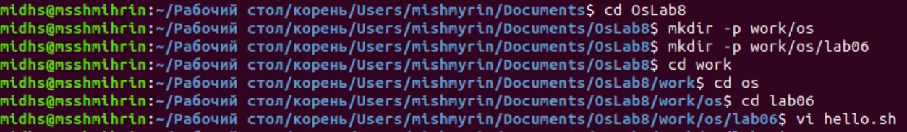
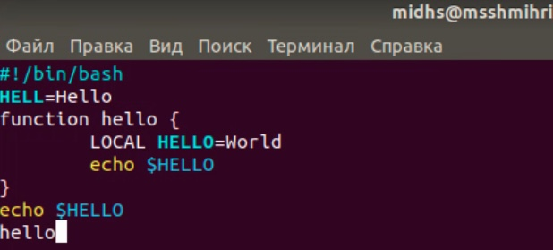
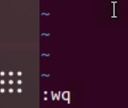
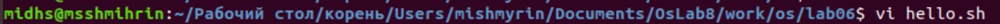
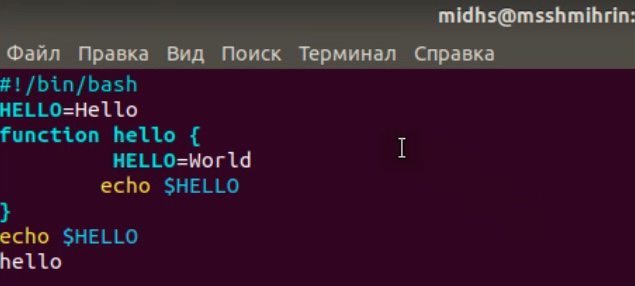
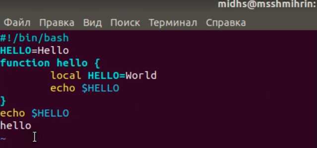
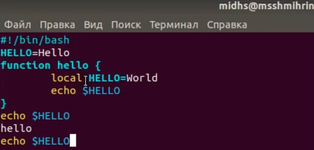
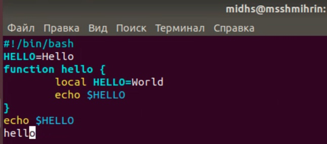
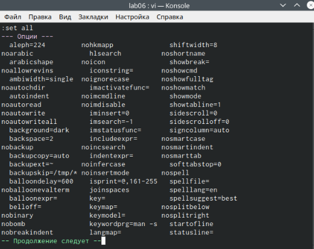
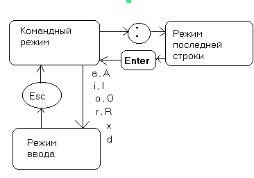

---
## Front matter
title: "Отчёт по лабораторной работе №8"
subtitle: "Дисциплина: Операционные системы"
author: "Шмырин Михаил Сергеевич"

## Generic otions
lang: ru-RU
toc-title: "Содержание"

## Bibliography
bibliography: bib/cite.bib

## Pdf output format
toc: true # Table of contents
toc-depth: 2
lof: true # List of figures
lot: true # List of tables
fontsize: 12pt
linestretch: 1.5
papersize: a4
documentclass: scrreprt
## I18n polyglossia
polyglossia-lang:
  name: russian
  options:
	- spelling=modern
	- babelshorthands=true
polyglossia-otherlangs:
  name: english
## I18n babel
babel-lang: russian
babel-otherlangs: english
## Fonts
mainfont: PT Serif
romanfont: PT Serif
sansfont: PT Sans
monofont: PT Mono
mainfontoptions: Ligatures=TeX
romanfontoptions: Ligatures=TeX
sansfontoptions: Ligatures=TeX,Scale=MatchLowercase
monofontoptions: Scale=MatchLowercase,Scale=0.9
## Biblatex
biblatex: true
biblio-style: "gost-numeric"
biblatexoptions:
  - parentracker=true
  - backend=biber
  - hyperref=auto
  - language=auto
  - autolang=other*
  - citestyle=gost-numeric
## Pandoc-crossref LaTeX customization
figureTitle: "Рис."
tableTitle: "Таблица"
listingTitle: "Листинг"
lofTitle: "Список иллюстраций"
lotTitle: "Список таблиц"
lolTitle: "Листинги"
## Misc options
indent: true
header-includes:
  - \usepackage{indentfirst}
  - \usepackage{float} # keep figures where there are in the text
  - \floatplacement{figure}{H} # keep figures where there are in the text
---

# Цель работы

Познакомиться с операционной системой Linux. Получить практические навыки работы с редактором vi, установленным по умолчанию практически во всех дистрибутивах.

# Задание

Задание 1. Создание нового файла с использованием vi

Задание 2. Редактирование существующего файла

# Выполнение лабораторной работы

### Задание 1. Создание нового файла с использованием vi

1. Создаю каталог с именем ~/work/os/lab06. Перехожу во вновь созданный каталог. Вызываю vi и создаю файл hello.sh (рис. [-@fig:001])

{ #fig:001 width=70% }

2. Нажимаем клавишу i и вводим следующий текст.(рис. [-@fig:002])

{ #fig:002 width=70% }

3. Нажимаем клавишу Esc для перехода в командный режим после завершения ввода текста. 

4. Нажимаем : для перехода в режим последней строки и внизу экрана появилось приглашение в виде двоеточия.

5. Нажимаем w (записать) и q (выйти), а затем нажимаем клавишу Enter для сохранения текста и завершения работы.(рис. [-@fig:003])

{ #fig:003 width=35% }

6. Делаем файл исполняемым (рис. [-@fig:004])

{ #fig:004 width=70% }

### Задание 2. Редактирование существующего файла

1. Вызов vi на редактирование файла (рис. [-@fig:005])

{ #fig:005 width=70% }

2. Устанавливаю курсор в конец слова HELL второй строки с помощью горячих клавиш.

3. Перехожу в режим вставки с помощью клавиши i и заменяю на HELLO. Нажимаю Esc для возврата в командный режим.(рис. [-@fig:006])

4. Устанавливаю курсор на четвертую строку и стираю слово LOCAL. (рис. [-@fig:006])

{ #fig:006 width=70% }

5. Перехожу в режим вставки и набираю следующий текст: local, нажимаю Esc для возврата в командный режим. (рис. [-@fig:007])

{ #fig:007 width=70% }

6. Устанавливаю курсор на последней строке файла с помощью клавиши G. Вставляю после неё строку, содержащую следующий текст: echo $HELLO и нажмаю Esc для перехода в командный режим. (рис. [-@fig:008])

{ #fig:008 width=70% }

7. Удаляю последнюю строку.(рис. [-@fig:009])

{ #fig:009 width=70% }

8. Ввожу команду отмены изменений с помощью клавиши u для отмены последней команды.(рис. [-@fig:010])

{ #fig:010 width=70% }

10. Ввожу символ : для перехода в режим последней строки. Записываю произведённые изменения (с помощью клавиши w) и выхожу из vi (с помощью клавиши q).(рис. [-@fig:011])

{ #fig:011 width=35% }

# Выводы

Я познакомился с операционной системой Linux. Получил практические навыки работы с редактором  vi, установленным по умолчанию практически во всех дистрибутивах.

# Ответы на контрольные вопросы

1. Редактор vi имеет три режима работы:
    1) командный режим − предназначен для ввода команд редактирования и навигации по редактируемому файлу;
    2) режим вставки − предназначен для ввода содержания редактируемого файла;
    3) режим последней (или командной) строки − используется для записи изменений в файл и выхода из редактора.
    
2. Чтобы выйти из редактора, не сохраняя произведённые изменения, нужно в режиме командной строки нажать клавиши «:» «q» «!»

3. Команды позиционирования:
    1) «0»(ноль) − переход в начало строки;
    2) «$» − переход в конец строки;
    3) «G» − переход в конец файла;
    4) n«G» − переход на строку с номером n.
    
4. При использовании прописных W и B под разделителями понимаются только пробел, табуляция и возврат каретки. При использовании строчных w и b под разделителями понимаются также любые знаки пунктуации.

5. Чтобы из любого места редактируемого файла перейти в начало (конец) файла, нужно в режиме командной строки нажать клавиши «1» «G» («G»).

6. Команды редактирования:

  1.  Вставка текста:
  
- «а» − вставить текст после курсора;

- «А» − вставить текст в конец строки;

- «i» − вставить текст перед курсором;

- n «i» − вставить текст n раз;

- «I» − вставить текст в начало строки.

  2. Вставка строки:
  
- «о» − вставить строку под курсором;

- «О» − вставить строку над курсором.

  3. Удаление текста:
  
- «x» − удалить один символ в буфер;

- «d» «w» − удалить одно слово в буфер;

- «d» «$» − удалить в буфер текст от курсора до конца строки;

- «d» «0» − удалить в буфер текст от начала строки до позиции курсора;

- «d» «d» − удалить в буфер одну строку;

- n «d» «d» − удалить в буфер n строк.

  4. Отмена и повтор произведённых изменений
  
- «u» − отменить последнее изменение;

- «.» − повторить последнее изменение.

  5. Копирование текста в буфер
  
- «Y» − скопировать строку в буфер;

- n «Y» − скопировать n строк в буфер;

- «y» «w» − скопировать слово в буфер.
    
 6. Вставка текста из буфера

- «p» − вставить текст из буфера после курсора;

- «P» − вставить текст из буфера перед курсором.

  7. Замена текста
  
- «c» «w» − заменить слово;
    
- n «c» «w» − заменить nслов;
    
- «c» «$» − заменить текст от курсора до конца строки;
    
- «r» − заменить слово;
    
- «R» − заменить текст.
    
  8. Поиск текста
  
    • «/» текст − произвести поиск вперёд по тексту указанной строки символов текст;
    • «?» текст − произвести поиск назад по тексту указанной строки символов текст.
    
  9. Копирование и перемещение текста
    • «:» n,m «d» – удалить строки с n по m;
    • «:» i,j «m» k – переместить строки с i по j, начиная со строки k;
    • «:» i,j «t» k – копировать строки с i по j в строку k;
    • «:» i,j «w» имя-файла – записать строки с i по j в файл с именем имя-файла.
    
7. Чтобы заполнить строку символами », чтобы заменить текст от курсора до конца строки, и ввести символы $.

8. Чтобы отменить по одному предыдущему действию последовательно, необходимо нажать «u». Чтобы отменить все изменения, произведённые со времени последней записи, нужно нажать «:» «e» «!».

9. Команды редактирования в режиме командной строки
    1. Копирование и перемещение текста
    • «:»n,m «d» − удалить строки с n по m;
    • «:»i,j «m» k − переместить строки с i по j, начиная со строки k;
    • «:»i,j «t» k − копировать строки с i по j в строку k;
    • «:»i,j «w» имя-файла − записать строки с i по j в файл с именем имя-файла.

    2. Запись в файл и выход из редактора
    • «:» «w» − записать изменённый текст в файл, не выходя из vi;
    • «:» «w» имя-файла − записать изменённый текст в новый файл с именем имя-файла;
    • «:» «w» «!» имя-файла − записать изменённый текст в файл с именем имя-файла;
    • «:» «w» «q» − записать изменения в файл и выйти из vi;
    • «:» «q» − выйти из редактора vi;
    • «:» «q» «!» − выйти из редактора без записи;
    • «:» «e» «!» − вернуться в командный режим, отменив все изменения, произведённые со времени последней записи.
    
    3. Опции
Опции редактора vi позволяют настроить рабочую среду. Для задания опций используется команда set (в режиме последней строки):
    • «:»set all − вывести полный список опций;
    • «:»set nu − вывести номера строк;
    • «:»set list − вывести невидимые символы;
    • «:»set ic − не учитывать при поиске, является ли символ прописным или строчным.
Если вы хотите отказаться от использования опции, то в команде set перед именем опции надо поставить no.

10. Чтобы определить, не перемещая курсора, позицию, в которой заканчивается строка, нужно в командном режиме находясь на нужной строке нажать «$» и посмотреть на число после запятой в правом нижнем углу экрана.

11. Опции редактора vi позволяют настроить рабочую среду. Для задания опций используется команда set (в режиме командной строки). Если вы хотите отказаться от использования опции, то в команде set перед именем опции надо поставить no. Чтобы просмотреть опции редактора vi, необходимо нажать «:» set all. Нажав «:» help “название_опции”, можно узнать назначение конкретной опции. (рис. [-@fig:013])

{ #fig:013 width=70% }

12. В режиме командной строки внизу редактора присутствует «:», в режиме ввода – «–ВСТАВКА –», в командном режиме внизу ничего нет.

13. Граф взаимосвязи режимов работы редактора vi. (рис. [-@fig:014])

{ #fig:014 width=70% }

