---
## Front matter
lang: ru-RU
title: Презентация по лабораторной работе №9
author: |
	Шмырин Михаил Сергеевич (группа: НПМбд-02-21)
institute: |
	Российский Университет Дружбы Народов

## Formatting
toc: false
slide_level: 2
theme: metropolis
header-includes: 
 - \metroset{progressbar=frametitle,sectionpage=progressbar,numbering=fraction}
 - '\makeatletter'
 - '\beamer@ignorenonframefalse'
 - '\makeatother'
aspectratio: 43
section-titles: true
---

# Цель работы

Познакомиться с операционной системой Linux.Получить практические навыки работы с редактором Emacs.

# Выполнение лабораторной работы

1. Открываю emacs.(рис. [-@fig:001]) (рис. [-@fig:002])

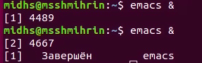{ #fig:001 width=40% }

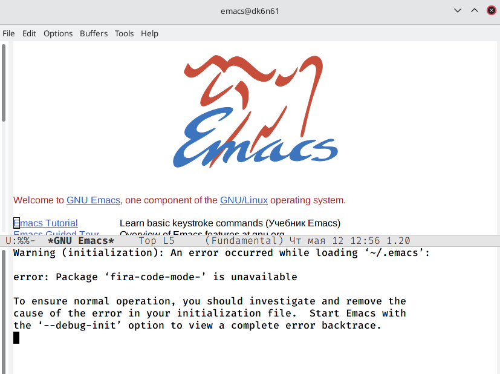{ #fig:002 width=40% }

## Cоздание файла lab07

2. Создаю файл lab07.sh с помощью комбинации Ctrl-x Ctrl-f (рис. [-@fig:003])

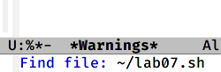{ #fig:003 width=50% }

## Ввод текста

3. Набираю текст: (рис. [-@fig:004])

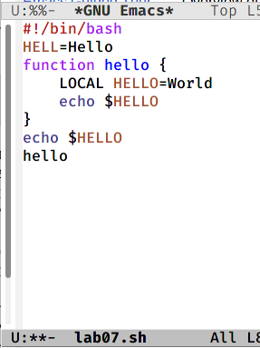{ #fig:004 width=35% }

4. Сохраняю файл с помощью комбинации Ctrl-x Ctrl-s.

## Cтандартные процедуры редактирования

5. Проделываю с текстом стандартные процедуры редактирования, каждое действие должно осуществляться комбинацией клавиш.

  5.1. Вырезаю одной командой целую строку (С-k).(рис. [-@fig:005])

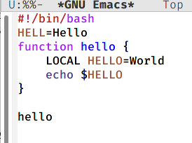{ #fig:005 width=50% }
  
## Вставляем строку в конец файла
  
  5.2. Вставляю эту строку в конец файла (C-y).(рис. [-@fig:006])

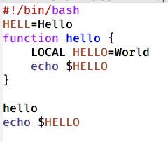{ #fig:006 width=50% }

## Выделяем область текста
  
  5.3. Выделяю область текста (C-space).(рис. [-@fig:007])

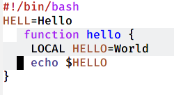{ #fig:007 width=37% }
  
  5.4. Копирую область в буфер обмена (M-w).
  
## Вставляем область в конец файла
  
  5.5. Вставляю область в конец файла. (рис. [-@fig:009])

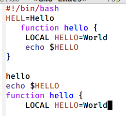{ #fig:009 width=50% }

## Вырезаем область
  
  5.6. Вновь выделяю эту область и на этот раз вырезаю её (C-w).[-@fig:010])

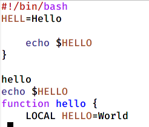{ #fig:010 width=50% }

## Отмена последнего действия
  
  5.7.  Отменяю последнее действие (C-/).(рис. [-@fig:011])

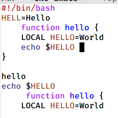{ #fig:011 width=55% }

## Учусь использовать команды по перемещению курсора.

6.1. Перемещаю курсор в начало строки (C-a).

6.2. Перемещаю курсор в конец строки (C-e).

6.3. Перемещаю курсор в начало буфера (M-<).

6.4. Перемещаю курсор в конец буфера (M->).

## Управление буферами.

7.1. Вывожу список активных буферов на экран (C-x C-b) (рис. [-@fig:012])

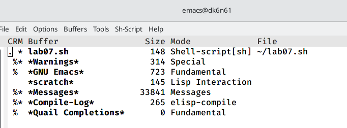{ #fig:012 width=55% }

## Переключение на другой буфер

7.2. Переместитесь во вновь открытое окно (C-x) o со списком открытых буферови переключитесь на другой буфер.(рис. [-@fig:013])

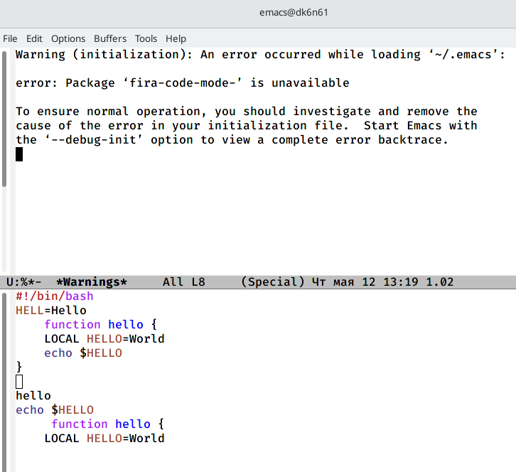{ #fig:013 width=55% }

## Закрываю окно со списком буферов

7.3. Закрываю это окно (C-x 0).(рис. [-@fig:014])

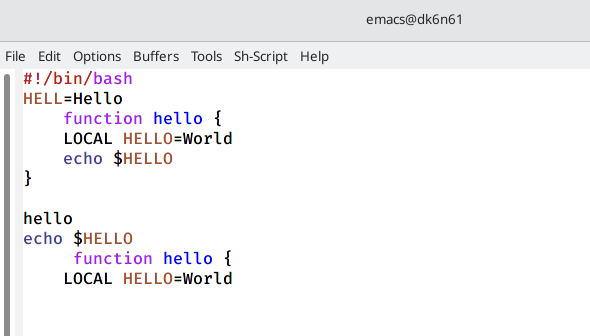{ #fig:014 width=55% }

## Переключение на другой буфер

7.4. Теперь вновь переключаюсь между буферами, но уже без вывода их списка наэкран (C-x b).(рис. [-@fig:015])

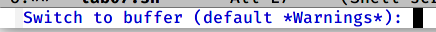{ #fig:015 width=55% }

## Управление окнами.

8.1. Делю фрейм на 4 части: разделите фрейм на два окна по вертикали (C-x 3), а затем каждое из этих окон на две части по горизонтали (C-x 2)(рис. [-@fig:016])

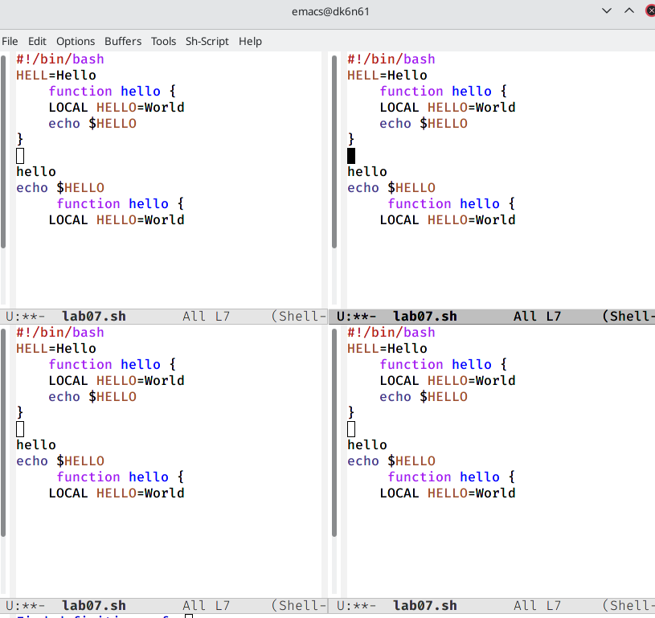{ #fig:016 width=55% }

## Ввод текста

8.2. В каждом из четырёх созданных окон открываю новый буфер (файл) и ввожу текст.(рис. [-@fig:017])

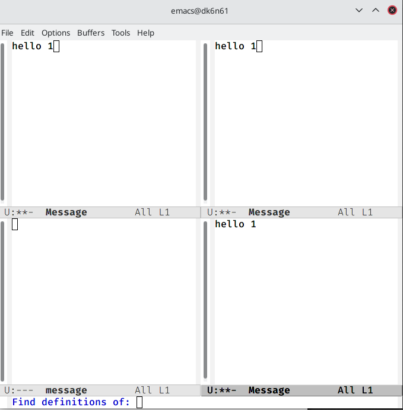{ #fig:017 width=55% }

## Режим поиска

9.1.Переключаюсь в режим поиска (C-s) и нахожу несколько слов, присутствующих в тексте.(рис. [-@fig:018])

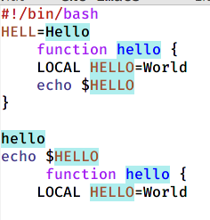{ #fig:018 width=35% }

9.2. Переключаюсь между результатами поиска, нажимая C-s.

9.3. Выхожу из режима поиска, нажав C-g.

## Режим поиска и замены

9.4. Перехожу в режим поиска и замены (M-%), ввожу текст, который следует найти и заменить, нажимаю Enter, затем ввожу текст для замены. После того как будут подсвечены результаты поиска(рис. [-@fig:019]), нажимаю ! для подтверждения замены.(рис. [-@fig:020])

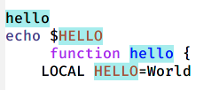{ #fig:019 width=35% }

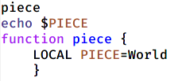{ #fig:020 width=35% }

# Выводы

Я познакомился с операционной системой Linux, получил практические навыки работы с редактором Emacs.