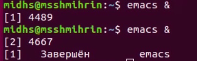

---
## Front matter
title: "Отчёт по лабораторной работе №9"
subtitle: "Дисциплина: Операционные системы"
author: "Шмырин Михаил Сергеевич"

## Generic otions
lang: ru-RU
toc-title: "Содержание"

## Bibliography
bibliography: bib/cite.bib
csl: pandoc/csl/gost-r-7-0-5-2008-numeric.csl

## Pdf output format
toc: true # Table of contents
toc-depth: 2
lof: true # List of figures
lot: true # List of tables
fontsize: 12pt
linestretch: 1.5
papersize: a4
documentclass: scrreprt
## I18n polyglossia
polyglossia-lang:
  name: russian
  options:
	- spelling=modern
	- babelshorthands=true
polyglossia-otherlangs:
  name: english
## I18n babel
babel-lang: russian
babel-otherlangs: english
## Fonts
mainfont: PT Serif
romanfont: PT Serif
sansfont: PT Sans
monofont: PT Mono
mainfontoptions: Ligatures=TeX
romanfontoptions: Ligatures=TeX
sansfontoptions: Ligatures=TeX,Scale=MatchLowercase
monofontoptions: Scale=MatchLowercase,Scale=0.9
## Biblatex
biblatex: true
biblio-style: "gost-numeric"
biblatexoptions:
  - parentracker=true
  - backend=biber
  - hyperref=auto
  - language=auto
  - autolang=other*
  - citestyle=gost-numeric
## Pandoc-crossref LaTeX customization
figureTitle: "Рис."
tableTitle: "Таблица"
listingTitle: "Листинг"
lofTitle: "Список иллюстраций"
lotTitle: "Список таблиц"
lolTitle: "Листинги"
## Misc options
indent: true
header-includes:
  - \usepackage{indentfirst}
  - \usepackage{float} # keep figures where there are in the text
  - \floatplacement{figure}{H} # keep figures where there are in the text
---

# Цель работы

Познакомиться с операционной системой Linux.Получить практические навыки работы с редактором Emacs.

# Выполнение лабораторной работы

1. Открываю emacs.(рис. [-@fig:001]) (рис. [-@fig:002])

{ #fig:001 width=50% }

{ #fig:002 width=50% }

2. Создаю файл lab07.sh с помощью комбинации Ctrl-x Ctrl-f (рис. [-@fig:003])

{ #fig:003 width=50% }

3. Набираю текст: (рис. [-@fig:004])

{ #fig:004 width=50% }

4. Сохраняю файл с помощью комбинации Ctrl-x Ctrl-s.

5. Проделываю с текстом стандартные процедуры редактирования, каждое действие должно осуществляться комбинацией клавиш.

  5.1. Вырезаю одной командой целую строку (С-k).(рис. [-@fig:005])

{ #fig:005 width=50% }
  
  5.2. Вставляю эту строку в конец файла (C-y).(рис. [-@fig:006])

{ #fig:006 width=50% }
  
  5.3. Выделяю область текста (C-space).(рис. [-@fig:007])

{ #fig:007 width=50% }
  
  5.4. Копирую область в буфер обмена (M-w).
  
  5.5. Вставляю область в конец файла. (рис. [-@fig:009])

{ #fig:009 width=50% }
  
  5.6. Вновь выделяю эту область и на этот раз вырезаю её (C-w).[-@fig:010])

{ #fig:010 width=50% }
  
  5.7.  Отменяю последнее действие (C-/).(рис. [-@fig:011])

{ #fig:011 width=55% }

6. Учусь использовать команды по перемещению курсора.

6.1. Перемещаю курсор в начало строки (C-a).

6.2. Перемещаю курсор в конец строки (C-e).

6.3. Перемещаю курсор в начало буфера (M-<).

6.4. Перемещаю курсор в конец буфера (M->).

7. Управление буферами.

7.1. Вывожу список активных буферов на экран (C-x C-b) (рис. [-@fig:012])

{ #fig:012 width=55% }

7.2. Переместитесь во вновь открытое окно (C-x) o со списком открытых буферови переключитесь на другой буфер.(рис. [-@fig:013])

{ #fig:013 width=55% }

7.3. Закрываю это окно (C-x 0).(рис. [-@fig:014])

{ #fig:014 width=55% }

7.4. Теперь вновь переключаюсь между буферами, но уже без вывода их списка наэкран (C-x b).(рис. [-@fig:015])

{ #fig:015 width=55% }

8. Управление окнами.

8.1. Делю фрейм на 4 части: разделите фрейм на два окна по вертикали (C-x 3), а затем каждое из этих окон на две части по горизонтали (C-x 2)(рис. [-@fig:016])

{ #fig:016 width=55% }

8.2. В каждом из четырёх созданных окон открываю новый буфер (файл) и ввожу текст.(рис. [-@fig:017])

{ #fig:017 width=55% }

9. Режим поиска

9.1.Переключаюсь в режим поиска (C-s) и нахожу несколько слов, присутствующих в тексте.(рис. [-@fig:018])

{ #fig:018 width=60% }

9.2. Переключаюсь между результатами поиска, нажимая C-s.

9.3. Выхожу из режима поиска, нажав C-g.

9.4. Перехожу в режим поиска и замены (M-%), ввожу текст, который следует найти и заменить, нажимаю Enter, затем ввожу текст для замены. После того как будут подсвечены результаты поиска(рис. [-@fig:019]), нажимаю ! для подтверждения замены.(рис. [-@fig:020])

{ #fig:019 width=60% }

{ #fig:020 width=60% }

# Выводы

Я познакомился с операционной системой Linux, получил практические навыки работы с редактором Emacs.

# Ответы на контрольные вопросы

1. Emacs − один из наиболее мощных и широко распространеM нных редакторов, используемых в мире Unix. По популярности он соперничает с редактором vi и его клонами. В зависимости от ситуации, Emacs может быть текстовым редактором; программой  для чтения почты и новостей  Usenet; интегрированной  средой  разработки (IDE); операционной системой  и т.д. ВсеM  это разнообразие достигается благодаря архитектуре Emacs, которая позволяет расширять возможности редактора при помощи языка Emacs Lisp. На языке C написаны лишь самые базовые и низкоуровневые части Emacs, включая полнофункциональный интерпретатор языка Lisp. Таким образом, Emacs имеет встроенныий  язык программирования, который  может использоваться для настроийки, расширения и изменения поведения редактора. В действительности, большая часть того редактора, с которым пользователи Emacs работают в наши дни,написана на языке Lisp. 

2. Основную трудность для новичков при освоенииданного редактора могутсоставлять большое количество команд, комбинаций  клавиш, которые не получится все запомнить с первого раза и поэтоупридется часто обращаться к справочным материалам. 

3. Буфер – это объект, представляющий  собой  текст. Если имеется несколько буферов, то редактировать можно только один. Обычно буфер считывает данные из файла или записывает в файл данные из буфера.Окно –это область экрана, отображающая буфер. При запуске редактора отображается одно окно, но при обращении к некоторым функциям могут открыться дополнительные окна. Окна Emacsи окна графической  среды XWindow–разные вещи. Одно окно XWindowможет быть разбито на несколько окон в смысле Emacs, в каждом из которых отображается отдельный  буфер. 

4. Да, можно. 

5. При запуске Emacs по умолчанию создаются следующие буферы: «scratch»(буфер для несохраненного текста) «Messages»(журнал ошибок, включающий  такжеинформацию, которая появляется в области EchoArea) «GNUEmacs»(справочный буфер о редакторе). 

6. C-c |сначала, удерживая «ctrl»,нажимаю «c»,после –отпускаюобе клавишии нажимаю «|» C-cC-|сначала, удерживая «ctrl»,нажимаю «с», после –отпускаю обе клавиши и, удерживая «ctrl», нажимаю «|». 

7. Чтобы поделить окно на две части необходимо воспользоваться комбинацией  «Ctrl-x 3»(по вертикали) или «Ctrl-x 2» (по горизонтали). 

8. Настройки Emacs хранятся в файле emacs. 

9. По умолчанию клавиша «←» удаляет символ перед курсором, но в редакторе ееM  можно переназначить. Для этого необхдимоизменить конфигурацию файла emacs. 

10. Более удобным я считаю редактор emacs, потому что в нем проще открывать другие файлы, можно использовать сразу несколько окон, нет «Командного режима», «Режима ввода», «Режима командной  строки», которые являются немного непривычными и в какой-то степени неудобными.
