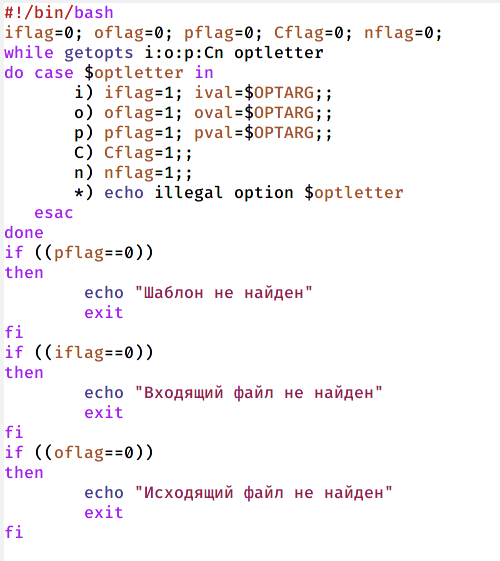
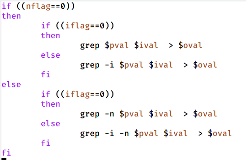
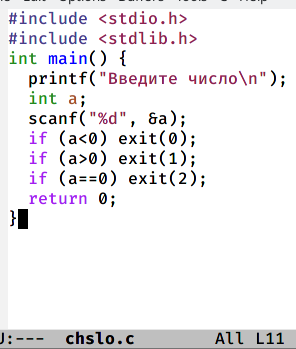
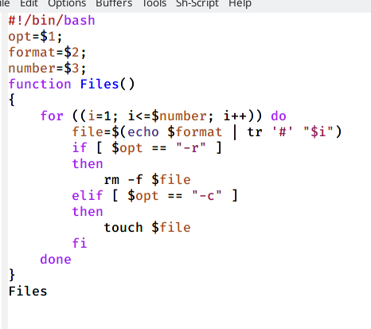
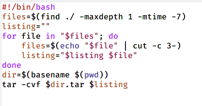

---
## Front matter
lang: ru-RU
title: Презентация по лабораторной работе №11
author: |
	Шмырин Михаил Сергеевич
institute: |
	Росийский Университет Дружбы Народов

## Formatting
toc: false
slide_level: 2
theme: metropolis
header-includes: 
 - \metroset{progressbar=frametitle,sectionpage=progressbar,numbering=fraction}
 - '\makeatletter'
 - '\beamer@ignorenonframefalse'
 - '\makeatother'
aspectratio: 43
section-titles: true
---

# Цель работы

Изучить основы программирования в оболочке ОС UNIX. Научится писать более сложные командные файлы с использование млогических управляющих конструкций циклов.

# Выполнение лабораторной работы

## Задание 1

1. 1) Используя команды getopts grep, написал командный файл, который анализирует командную строку с ключами: 

* -iinputfile — прочитать данные из указанного файла;

* -ooutputfile — вывести данные в указанный файл;

* -pшаблон — указать шаблон для поиска;

* -C — различать большие и малые буквы;

* -n — выдавать номера строк. 
а затем ищет в указанном файле нужные строки, определяемые ключом -p. Для данной задачи я создал файл progra1.sh и написал соответствующий скрипт (рис. [-@fig:002]) , (рис. [-@fig:003])  

## Скрипт

{ #fig:002 width=25% }

{ #fig:003 width=25% }

## Проверка работы

  2) Проверил работу написанного скрипта, используя различные опции (например команду ./progra1.sh -i a1.txt -o a2.txt -C -n), предварительно добавив право на исполнение файла (chmod +x progra1.sh) и создав 2 файла, которые необходимы для выполнения программы (a1.txt, a2.txt). Скрипт работает корректно.

## Задание 2

2. 1) Написал на языке Си программу, которая вводит число и определяет, является ли оно больше нуля, меньше нуля или равно нулю. Затем программа завершается с помощью функции exit(n), передавая информацию в о коде завершения в оболочку. Командный  файл должен вызывать эту программу и, проанализировав с помощью команды $?, выдать сообщение о том, какое число было введено. Для данной задачи я создал 2 файла: chslo.c chislo.sh и написал соответствующие скрипты (рис. [-@fig:006]) (рис. [-@fig:007])

## Скрипт

{ #fig:006 width=25% }

{ #fig:007 width=25% }

## Проверка работы

2) Проверил работу написанных скриптов (команда ./chislo.sh), предварительно добавив право на исполнение файла (chmod +x chislo.sh). Скрипты работают корректно.

## Задание 3

3. 1) Написал командный файл, создающий указанное число файлов, пронумерованных последовательно от 1 до   (например 1.tmp, 2.tmp, 𝑁3.tmp,4.tmp и т.д.). Число файлов, которые необходимо создать, передается в аргументы командной строки. Этот же командный файл должен уметь удалять все созданные им файлы (если они существуют). Для данной задачи я создал файл files.sh и написал соответствующий скрипт (рис. [-@fig:010])

## Скрипт

{ #fig:010 width=60% }

## Проверка работы

2) Далее я проверил работу написанного скрипта (./files.sh), предварительно добавив право на исполнене файла. Сначал я создал три файла, удовлетворяющих условию задач, а потом удалил их. Скрипт работает корректно (рис. [-@fig:011])

{ #fig:011 width=70% }

## Задание 4

4. 1) Написал командный файл, который с помощью команды tar запаковывает в архив все файлы в указанной директории. Модифицировал его так, чтобы запаковывались только те файлы, которые были изменены менее недели тому назад (использовать команду find). Для данной задачи я содал файл pr4.sh и написал соответствующий скрипт (рис. [-@fig:013])

## Скрипт

{ #fig:013 width=50% }

## Проверка работы

2) Далее я проверил работу написанного скрипта, предварительно добавив право на исполнение файла и создав отдельный каталог с несколькими файлами

# Выводы

В ходе выполнения лабораторной работы я изучил основы программирования в оболочке ОС UNIX и научился писать более сложные командные файлы с использованием логических управляющих конструкций циклов.

