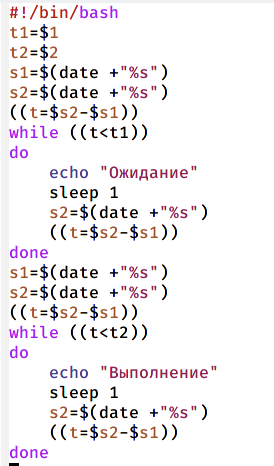
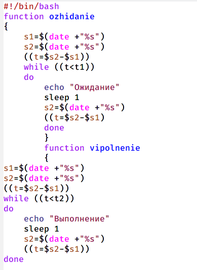
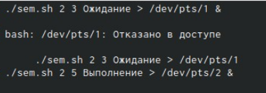
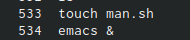
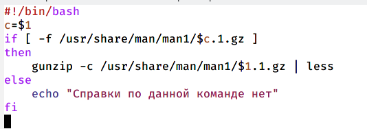
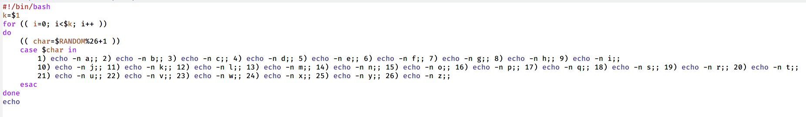

---
## Front matter
title: "Отчёт по лабораторной работе №12"
subtitle: "Дисциплина: Операционные системы"
author: "Шмырин Михаил Сергеевич"

## Generic otions
lang: ru-RU
toc-title: "Содержание"

## Bibliography
bibliography: bib/cite.bib
csl: pandoc/csl/gost-r-7-0-5-2008-numeric.csl

## Pdf output format
toc: true # Table of contents
toc-depth: 2
lof: true # List of figures
lot: true # List of tables
fontsize: 12pt
linestretch: 1.5
papersize: a4
documentclass: scrreprt
## I18n polyglossia
polyglossia-lang:
  name: russian
  options:
	- spelling=modern
	- babelshorthands=true
polyglossia-otherlangs:
  name: english
## I18n babel
babel-lang: russian
babel-otherlangs: english
## Fonts
mainfont: PT Serif
romanfont: PT Serif
sansfont: PT Sans
monofont: PT Mono
mainfontoptions: Ligatures=TeX
romanfontoptions: Ligatures=TeX
sansfontoptions: Ligatures=TeX,Scale=MatchLowercase
monofontoptions: Scale=MatchLowercase,Scale=0.9
## Biblatex
biblatex: true
biblio-style: "gost-numeric"
biblatexoptions:
  - parentracker=true
  - backend=biber
  - hyperref=auto
  - language=auto
  - autolang=other*
  - citestyle=gost-numeric
## Pandoc-crossref LaTeX customization
figureTitle: "Рис."
tableTitle: "Таблица"
listingTitle: "Листинг"
lofTitle: "Список иллюстраций"
lotTitle: "Список таблиц"
lolTitle: "Листинги"
## Misc options
indent: true
header-includes:
  - \usepackage{indentfirst}
  - \usepackage{float} # keep figures where there are in the text
  - \floatplacement{figure}{H} # keep figures where there are in the text
---

# Цель работы

Изучить основы программирования в оболочке ОС UNIX. Научиться писать более сложные командные файлы с использованием логических управляющих конструкций циклов.

# Выполнение лабораторной работы

1. 1) Написал командный файл, реализующий упрощённый механизм семафоров. Командный файл должен в течение некоторого времени t1 дожидаться освобождения ресурса, выдавая об этом сообщение, а дождавшись его освобождения, использовать его в течение некоторого времени t2<>t1, также выдавая информацию о том, что ресурс используется соответствующим командным файлом (процессом). Для данной задачи я создал файл sem.sh (рис. [-@fig:001]) и написал соответствующий скрипт (рис. [-@fig:002]).

{ #fig:001 width=50% }

{ #fig:002 width=50% }

  2) Далее я проверил работу написанного скрипта (./sem.sh 4 7), предварительно предоставив файлу право на исполнение (chmod +x sem.sh). Скрипт работает корректно 

  3) После этого я изменил скрипт так, чтобы его можно было выполнять в нескольких терминалах и прверил его работу ( например команда ./sem.sh 2 3 Ожидание > /dev/pts/1 &) (рис. [-@fig:004]) (рис. [-@fig:005]). После проверил работу скрипта и увидела, что мне было отказано в доступе (рис. [-@fig:006])
  
{ #fig:004 width=50% }

{ #fig:005 width=50% }

{ #fig:006 width=50% }

2. 1) Реализовал команду man с помощью командного файла. Изучил содержимое каталога /usr/share/man/man1 (рис. [-@fig:007]). В нем находятся архивы текстовых файлов, содержащих справку по большинству установленных в системе программ и команд. Каждый архив можно открыть командой less сразу же просмотрев содержимое справки. Командный файл должен получать в виде аргумента командной строки название команды и в виде результата выдавать справку об этой команде или сообщение об отсутствии справки, если соответствующего файла нет в каталоге man1

{ #fig:007 width=50% }

  2) Для данной задачи я создал файл man.sh (рис. [-@fig:008]) и написал соответствующий скрипт (рис. [-@fig:009])

{ #fig:008 width=50% }

{ #fig:009 width=50% }

  3) Далее я проверил работу написанного скрипта (./man.sh ls и ./man.sh mkdir) , предварительно добавив право на исполнение файла (chmod +x man.sh). Скрипт работает корректно.
  

3. 1) Используя встроенную переменную $RANDOM, написал командный файл, генерирующий случайную последовательность букв латинского алфавита. Учла, что $RANDOM выдаёт псевдослучайные числа в диапазоне от 0 до 32767.Для данной задачи я создал файл mmm.sh (рис. [-@fig:011]) и написал соответствующий скрипт (рис. [-@fig:012])

{ #fig:011 width=50% }

{ #fig:012 width=50% }

2) Далее я проверил работу написанного скрипта (./random.sh 7; 17), предварительно добавив право на исполднение файла. Скрипт работает корректно

# Выводы

В ходе выполнения лабораторной работы я изучил основы программирования в оболочке ОС UNIX и научилась писать более сложные командные файлы с использованием логических управляющих конструкций циклов.

# Ответы на контрольные вопросы

1. 1). while [$1 != “exit”] В данной строчке допущены следующие ошибки: 

* не хватает пробелов после первой скобки [и перед второй скобкой ] 

* выражение $1 необходимо взять в “”, потому что эта переменная может содержать пробелы. Таким образом, правильный вариант должен выглядеть так: while [“$1”!= “exit”] 

2. Чтобы объединить несколько строк в одну, можно воспользоваться несколькими способами:

* Первый: VAR1="Hello, “VAR2=” World" VAR3=“VAR2” echo “$VAR3” Результат: Hello, World

* Второй: VAR1=“Hello,” VAR1+=” World” echo “$VAR1” Результат: Hello, World 

3. Команда seq в Linux используется для генерации чисел от ПЕРВОГО до ПОСЛЕДНЕГО шага INCREMENT. Параметры: seq LAST: если задан только один аргумент, он создает числа от 1 до LAST с шагом шага, равным 1. Если LAST меньше 1, значение is не выдает. • seq FIRST LAST: когда заданы два аргумента, он генерирует числа от FIRST до LAST с шагом 1, равным 1. Если LAST меньше FIRST, он не выдает никаких выходных данных. • seq FIRST INCREMENT LAST: когда заданы три аргумента, он генерирует числа от FIRST до LAST на шаге INCREMENT . Если LASTменьше, чем FIRST, он не производит вывод. • seq -f «FORMAT» FIRST INCREMENT LAST: эта команда используется для генерации последовательности в форматированном виде. FIRST и INCREMENT являются необязательными. • seq -s «STRING» ПЕРВЫИ~  ВКЛЮЧЕНО: Эта команда используется для STRING для разделения чисел. По умолчанию это значение равно /n.FIRST и INCREMENT являются необязательными. • seq -w FIRST INCREMENT LAST:эта команда используется для выравнивания ширины путем заполнения начальными нулями. FIRST и INCREMENT являются необязательными. 

4. Результатом данного выражения $((10/3))будет 3, потому что это целочисленное деление без остатка. 

5. Отличия командной оболочки zshот bash: • В zsh более быстрое автодополнение для cdс помощью Тab • В zsh существует калькулятор zcalc, способный выполнять вычисления внутри терминал • В zsh поддерживаются числа с плавающей запятой •В zsh поддерживаются структуры данных «хэш» • В zsh поддерживается раскрытие полного пути на основе неполных данных • В zsh поддерживаетсязаменачастипути • В zsh есть возможность отображать разделенный экран, такой же как разделенный экран vim 

6. for((a=1; a<= LIMIT; a++)) синтаксис данной конструкции верен, потому что, используя двойные круглые скобки, можно не писать $ перед переменными (). 

7. Преимущества скриптового языка bash:

* Один из самых распространенных и ставится по умолчаниюв большинстве дистрибутивах Linux, MacOS

* Удобное перенаправление ввода/вывода

* Большое количество команд для работы с файловыми системами Linux

* Можно писать собственные скрипты, упрощающие работу в Linux Недостатки скриптового языка bash: • Дополнительные библиотеки других языков позволяют выполнить больше действий • Bash не является языков 
общего назначения

* Утилиты, при выполнении скрипта, запускают свои процессы, которые, в свою очередь, отражаются на быстроте выполнения этого скрипта

* Скрипты, написанные на bash, нельзя запустить на других операционных системах без дополнительных действий.

