---
## Front matter
lang: ru-RU
title: Презентация к лабораторной работе №14
author: |
	Шмырин Михаил Сергеевич
institute: |
	Российский Университет Дружбы Народов
date: 

## Formatting
toc: false
slide_level: 2
theme: metropolis
header-includes: 
 - \metroset{progressbar=frametitle,sectionpage=progressbar,numbering=fraction}
 - '\makeatletter'
 - '\beamer@ignorenonframefalse'
 - '\makeatother'
aspectratio: 43
section-titles: true
---

# Цель работы

Цель данной лабораторной работы - приобрести практические навыки работы с именованными каналами.

# Выполнение лабораторной работы

1. Для выполнения лабораторной работы создал четыре файл с помощью команды touch и откроем их в emacs для редактирования (рис. [-@fig:01])

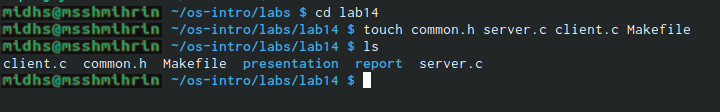{ #fig:01 width=70% }

## Изменение кода программ

2. Изменим код программ, предоставленных в тексте задания лабораторной работы. В файл common.h добавил стандартные заголовочные файлы unisd.h и time.h, которые необходимы для работы других файлов (рис. [-@fig:02]). Этот файл предназначен для заголовочных файлов, чтобы не прописывать их в других программах каждый раз

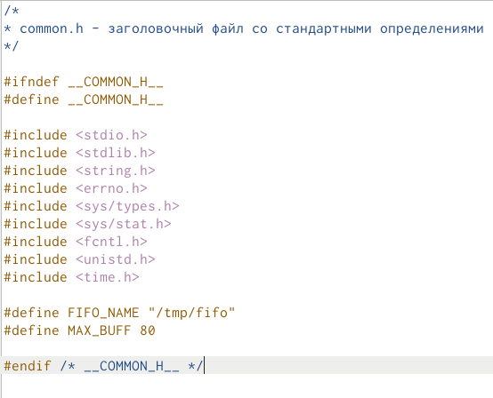{ #fig:02 width=40% }

## server.c

Затем в файл server.c добавим цикл while для контроля за временем работы сервера (рис. [-@fig:03],  [-@fig:04]), причем время от начал работы сервера до настоящего не должно превышать 30 секунд

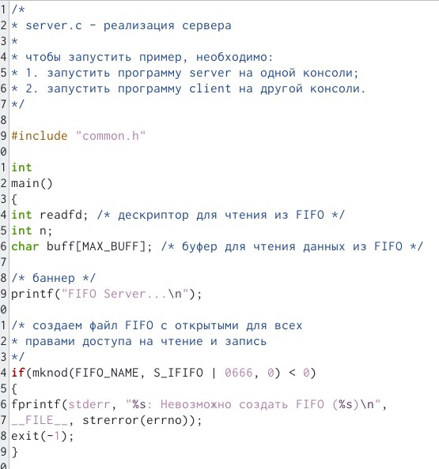{ #fig:03 width=35% }

## server.c

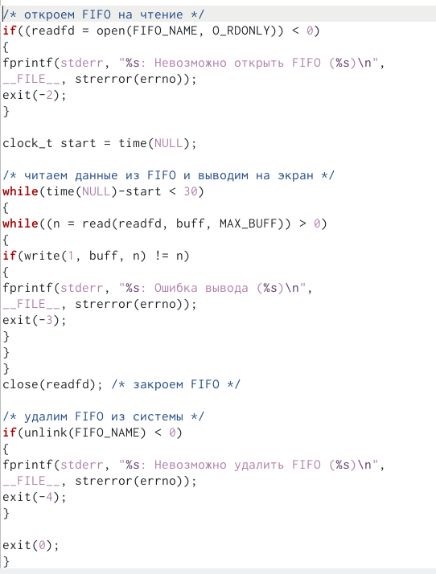{ #fig:04 width=35% }

## client.c

В файл client.c добавим цикл for который будет отвечать за количество сообщений о текущем времени (4 сообщения), и команду sleep(5) для остановки работы клиента через 5 секунд. Также я изменил выводимое сообщение на текущее время (рис. [-@fig:05],  [-@fig:06])

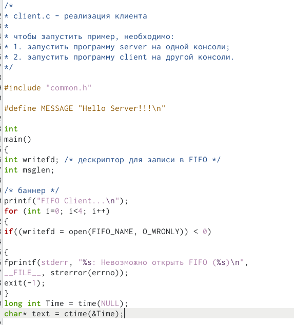{ #fig:05 width=40% }

## client.c

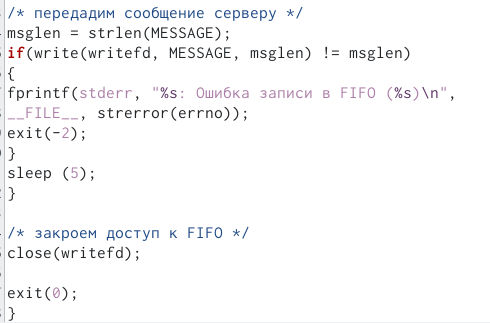{ #fig:06 width=50% }

## Makefile

Makefile оставил без изменений (рис. [-@fig:035])

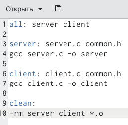{ #fig:035 width=60% }

## Компиляция

3. Используя команду make all (рис. [-@fig:094]), скомпилировал необходимые для работы файлы 

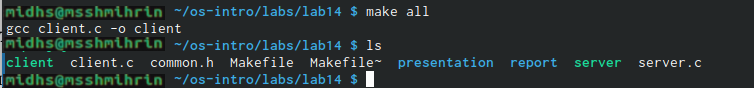{ #fig:094 width=70% }

## Проверка работы

4. Проверим работу написанного кода

Открыл три терминала, в первом окне запустил программу ./server, во втором и третьем ./client. В результате каждый терминал-клиент вывел по четыре сообщения о текущем времени. Спустя 30 секунд работы сервера был прекращена (рис. [-@fig:091] , [-@fig:092] , [-@fig:093])

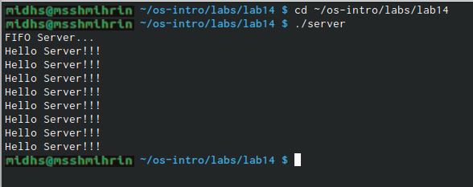{ #fig:091 width=50% }

## Проверка работы

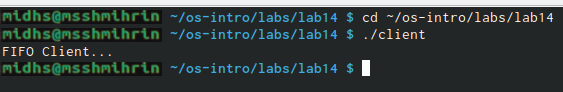{ #fig:092 width=50% }

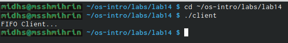{ #fig:093 width=50% }

Если клиент завершит свою работу, не закрыв канал, то при повторном запуске сервера появится ошибка "Невозможно закрыть FIFO", так как уже существует один канал.

# Выводы

Я приобрел практические навыки по работе с именованными каналами.
